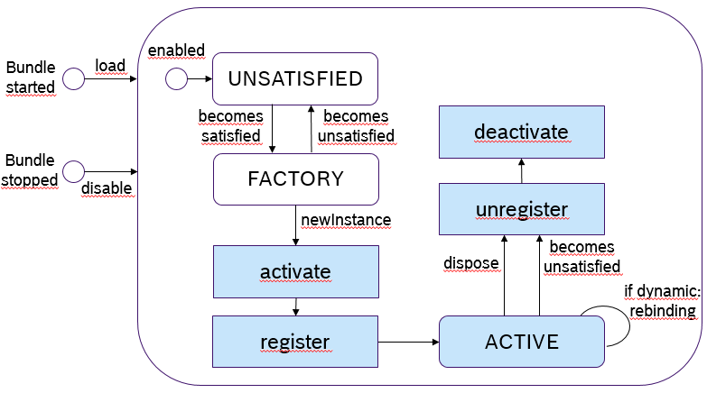

# Control OSGi DS Component Instances

There are use cases where a more fine grained control is needed for _component instance_ creation. 
I spent some time in investigating how this is done with OSGi Declarative Services in detail. 
It turned out that it is easier as it seems, mainly because of missing or misleading tutorials. 
In 2017 I wrote the blog posts [Control OSGi DS Component Instances](https://vogella.com/blog/control-osgi-ds-component-instances/) 
and [Control OSGi DS Component Instances via Configuration Admin](https://vogella.com/blog/control-osgi-ds-component-instances-via-configuration-admin/) 
as part of my OSGi Declarative Service blog post series, where I covered this topic. 
This blog post is the update of those blog posts, to cover the current state of the OSGi specification and the available tooling.
I dediced to combine the two blog posts into one, to find the related information in one place.

For the start you need to know that by default there is only one _component configuration_ created and activated in the OSGi runtime at the same time. 
This means that every bundle is sharing the same _component instance_. So you have a singleton instance for every service. 

_**Note:**_  
Singleton instance in terms of "one single instance" not "Singleton Pattern"!

If you think about multi-threading or context dependent services, you may need multiple instances of a service. In an OSGi environment there are basically the following categories:

- one service instance per _runtime_
- one service instance per _bundle_
- one service instance per _component/requestor_
- one service instance per _request_

Additonally there are scenarios where you need something like a session. But a session is nothing natural in the OSGi world. At least not as natural as it is in the context of a web application.
Anyhow, we add the following category:

- one service instance per _session/transation_

_**Note:**_  
Instance creation control can only be done for service components. So ensure to specify the service annotation type element in `@Component` if the implementation does not implement an interface.

To control the instance creation you can use the following mechanisms:

- Specify the _Service Scope_ by using the `scope` annotation type element of `@Component`
- Create a _Factory Component_ by using the `factory` annotation type element of `@Component`
- Create a _Component Configuration_ by using the `ConfigurationAdmin`

_**Note:**_  
The `servicefactory` annotation type element of `@Component` was deprecated with DS 1.3 in favour of the `scope` annotation type element. 
This tutorial will therefore not cover the `servicefactory` anymore.

## Preparation

For some hands on this topic, we first create some bundles to play with.

_**Note:**_  
I don't want to explain every step for creating services in detail in this blog post. Especially because it depends on the tooling and the project setup, e.g. PDE vs. Bndtools vs. Maven with Bndtools. 
If you don't know how to perform the necessary steps, please have a look at my [Getting Started with OSGi Declarative Services](getting-started-with-osgi-declarative-services.md) blog post.

1. Create an API bundle `org.fipro.oneshot.api` with a service interface `OneShot`
``` java
package org.fipro.oneshot;

public interface OneShot {
    void shoot(String target);
}
```

2. Create a provider bundle `org.fipro.oneshot.provider` with a service implementation `Hitman`
``` java
package org.fipro.oneshot.provider;

import java.util.concurrent.atomic.AtomicInteger;

import org.fipro.oneshot.OneShot;
import org.osgi.service.component.annotations.Component;

@Component
public class Hitman implements OneShot {

    private static AtomicInteger instanceCounter = new AtomicInteger();
    private final int instanceNo;

    public Hitman() { 
        instanceNo = instanceCounter.incrementAndGet(); 
    }

    @Override
    public void shoot(String target) { 
        System.out.println("BAM! I am hitman #" + instanceNo + ". And I killed " + target); 
    }
}
```
This implementation will count the number of instances in a static field and remembers it in a member variable, so we can identify the created instance when the service is called.

3. Create a command bundle `org.fipro.oneshot.command` with a console command to call the service
``` java
package org.fipro.oneshot.command;

import org.fipro.oneshot.OneShot;
import org.osgi.service.component.annotations.Component;
import org.osgi.service.component.annotations.Reference;

@Component(
      property= {
          "osgi.command.scope=fipro",
          "osgi.command.function=kill"
      },
      service=KillCommand.class)
public class KillCommand {

    @Reference
    private OneShot killer;

    public void kill(String target) {
        this.killer.shoot(target);
    }
}
 ```
4. Create a command bundle `org.fipro.oneshot.assassinate` with two different console commands that call the service
``` java
package org.fipro.oneshot.assassinate;

import org.fipro.oneshot.OneShot;
import org.osgi.service.component.annotations.Component;
import org.osgi.service.component.annotations.Reference;

@Component(
      property= {
          "osgi.command.scope=fipro",
          "osgi.command.function=assassinate"
      },
      service=AssassinateCommand.class
)
public class AssassinateCommand {

    @Reference
    private OneShot hitman;

    public void assassinate(String target) {
        hitman.shoot(target);
    }
}
```  
``` java
package org.fipro.oneshot.assassinate;

import org.fipro.oneshot.OneShot;
import org.osgi.service.component.ComponentContext;
import org.osgi.service.component.annotations.Activate;
import org.osgi.service.component.annotations.Component;
import org.osgi.service.component.annotations.Reference;

@Component(
    property= {
        "osgi.command.scope=fipro",
        "osgi.command.function=eliminate"
    },
    service=EliminateCommand.class,
    reference = @Reference(
        name="hitman",
        service=OneShot.class)
)
public class EliminateCommand {

    @Activate
    private ComponentContext context;

    public void eliminate(String target) {
        OneShot hitman = (OneShot) this.context.locateService("hitman");
        hitman.shoot(target);
    }
}
```

The `EliminateCommand` uses the _Lookup Strategy_ to lazily activate the referenced component. For this it needs the `ComponentContext` which is injected via field injection. The injection of the `ComponentContext` _activation object_ is supported since DS 1.4. Additionally it needs the information about the references to lookup. This can be done either by using a `ServiceReference` parameter in `ComponentContext#locateService()` or by configuring the _lookup strategy references_ via the `@Component` annotation, which is shown in the snippet above.

The usage of the _Lookup Strategy_ is probably quite useless in this example, but I wanted to show how it works and that it works fine.

## Scope

For _Delayed Components_ it is possible to specify a _service scope_, which is described in [OSGi Compendium - Declarative Services Specification - Synopsis](https://docs.osgi.org/specification/osgi.cmpn/8.1.0/service.component.html#d0e27557).
On the service consumer side, it is possible to configure the _reference scope_, which is desribed in [OSGi Compendium - Declarative Services Specification - Reference Scope](https://docs.osgi.org/specification/osgi.cmpn/8.1.0/service.component.html#service.component-reference.scope).

The following chapters will explain how to handle component instances by using scopes.

### One instance per runtime

There is not much to say about this. This is the default behavior if you do not specify something else. There is only one _component configuration_ created and activated. Therefore only one _component instance_ is created and shared between all bundles.

A singleton instance can be explicitly configured on the component by using the `scope` annotation type element with value `ServiceScope.SINGLETON`:

``` java
@Component(scope=ServiceScope.SINGLETON)
public class Hitman implements OneShot {
```

_**Note:**_  
For _Immediate Components_ and _Factory Components_ it is not allowed to use other values for `servicefactory` or `scope`!

If you launch an OSGi application with the necessary bundles (`org.apache.felix.scr`, `org.apache.felix.gogo.*`, `org.fipro.oneshot.*`) and call the commands _kill_, _assassinate_ and _eliminate_ one after the other, you should get an output similar to this (on a Felix console):

``` 
g! kill Dirk
BAM! I am hitman #1. And I killed Dirk
g! assassinate Dirk
BAM! I am hitman #1. And I killed Dirk
g! eliminate Dirk
BAM! I am hitman #1. And I killed Dirk
```

Every command has a reference to the same `Hitman` instance, as can be seen by the instance counter in the output.

### One instance per bundle

There are use cases where it is useful to have one _component configuration_ created and activated per bundle. For example if the component configuration contains special bundle related configurations.

A bundle scope service can be configured on the component by using the `scope` annotation type element with value `ServiceScope.BUNDLE`:

``` java
@Component(scope=ServiceScope.BUNDLE)
public class Hitman implements OneShot {
``` 

When launching the OSGi application and calling the commands _kill_, _assassinate_ and _eliminate_ one after the other, you should get an output similar to this (on a Felix console):

``` 
g! kill Dirk
BAM! I am hitman #1. And I killed Dirk
g! assassinate Dirk
BAM! I am hitman #2. And I killed Dirk
g! eliminate Dirk
BAM! I am hitman #2. And I killed Dirk
g! kill Dirk 
BAM! I am hitman #1. And I killed Dirk
```

You can see that the _kill_ command has a reference to the `Hitman` instance #1, while the _assassinate_ and the _eliminate_ command both have a reference to the `Hitman` instance #2, as both reside in the same bundle.

### One instance per requestor

There are some use cases where every consumer needs its own instance of a service.

For this scenario the `ServiceScope.PROTOTYPE` can be used.

``` java
@Component(scope=ServiceScope.PROTOTYPE)
public class Hitman implements OneShot {
``` 

Setting the _scope_ of the service component to `ServiceScope.PROTOTYPE` does not mean that every consumer gets a distinct service instance automatically. By default the result will be the same as with using the BUNDLE scope. So if you start the application with the updated `Hitman` service, you will get the same result as before.

The reason for this is the _reference scope_. It is configured on the consumer side via `@Reference` and specifies how the service reference should be resolved. There are three possible values:

- `ReferenceScope.BUNDLE`  
All component instances in a bundle will use the same service object. (default)
- `ReferenceScope.PROTOTYPE`  
Every component instance in a bundle **may** use a distinct service object.
- `ReferenceScope.PROTOTYPE_REQUIRED`  
Every component instance in a bundle **must** use a distinct service object.

As the default of the _reference scope_ is `ReferenceScope.BUNDLE`, we see the same behavior for _service scope_ `ServiceScope.PROTOTYPE` as we saw for _service scope_ `ServiceScope.BUNDLE`. That means the consumer components need to be modified to achieve that every command instance gets its own service instance.

``` java
@Component(
      property= {
          "osgi.command.scope=fipro",
          "osgi.command.function=assassinate"
      },
      service=AssassinateCommand.class )
public class AssassinateCommand {

      @Reference(scope=ReferenceScope.PROTOTYPE_REQUIRED)
      private OneShot hitman;

      public void assassinate(String target) {
          hitman.shoot(target);
      }
}
```

``` java
@Component(
      property= {
          "osgi.command.scope=fipro",
          "osgi.command.function=eliminate"
      },
      service=EliminateCommand.class,
      reference=@Reference(
          name="hitman",
          service=OneShot.class,
          scope=ReferenceScope.PROTOTYPE_REQUIRED)
)
public class EliminateCommand {

      @Activate
      private ComponentContext context;

      public void eliminate(String target) {
          OneShot hitman = (OneShot) this.context.locateService("hitman");
          hitman.shoot(target);
      }
}
```

_**Note:**_  
In the example I have chosen to use the _reference scope_ `ReferenceScope.PROTOTYPE_REQUIRED`. In the given scenario also `ReferenceScope.PROTOTYPE` would be sufficient, as the concrete service implementation uses the `ServiceScope.PROTOTYPE` _service scope_. But IMHO it is better to specify directly which reference scope to use, instead of having a weak rule.

When launching the OSGi application and calling the commands one after the other, you should get an output similar to this (on a Felix console):

``` 
g! kill Dirk
BAM! I am hitman #1. And I killed Dirk
g! assassinate Dirk
BAM! I am hitman #2. And I killed Dirk
g! eliminate Dirk
BAM! I am hitman #3. And I killed Dirk
g! kill Dirk
BAM! I am hitman #1. And I killed Dirk
g! eliminate Dirk
BAM! I am hitman #3. And I killed Dirk
```

You can see that every command instance gets its own service instance. For the `kill` command it was not necessary to specify the _reference scope_ because the bundle only has one consumer.

_**Note:**_  
The above output comes from an execution with the PDE project layout. If you run the example using Bndtools (with or without Maven) the _eliminate_ command will create a new instance everytime.
The reason is how the frameworks deal with service instance disposal. This is explained in more detail in [Component Instance Cleanup](#component-instance-cleanup).

### One instance per request

In some use cases it is required to have a distinct service instance per request. This is for example needed for web requests, where it is required that services are created and destroyed in every request, or for multi-threading where services can be executed in parallel (hopefully without side-effects).

Like before the `PROTOTYPE` scope helps in solving that requirement, in combination with the `ComponentServiceObjects` interface. The implementation of the `ComponentServiceObjects` is a factory that allows to create and destroy service instances on demand. 

The following example shows the usage. Create it in the `org.fipro.oneshot.command` bundle.

``` java
package org.fipro.oneshot.command;

import org.fipro.oneshot.OneShot;
import org.osgi.service.component.ComponentServiceObjects;
import org.osgi.service.component.annotations.Component;
import org.osgi.service.component.annotations.Reference;
import org.osgi.service.component.annotations.ReferenceScope;

@Component(
    property= {
        "osgi.command.scope=fipro",
        "osgi.command.function=terminate"
    },
    service=TerminateCommand.class )
public class TerminateCommand {

    // get a factory for creating prototype scoped service instances
    @Reference(scope=ReferenceScope.PROTOTYPE_REQUIRED)
    private ComponentServiceObjects<OneShot> oneShotFactory;

    public void terminate(String target) {
        // create a new service instance OneShot 
        OneShot oneShot = oneShotFactory.getService(); 
        try { 
            oneShot.shoot(target); 
        } 
        finally {
            // destroy the service instance 
            oneShotFactory.ungetService(oneShot); 
        } 
    } 
}
```

_**Note:**_  
There is no special modification needed in the _component configuration_ of the provider. It simply needs to be configured with a `ServiceScope.PROTOTYPE` as shown before. The consumer needs to decide what instance should be referenced, the same as every service in the bundle, a new one for every component or a new one for each request.

Executing the _terminate_ command multiple times will show that for each call a new `Hitman` instance is created. Mixing it with the previous commands will show that the other services keep a fixed instance, while _terminate_ constantly will create and use a new instance per execution.

```
g! kill Dirk
BAM! I am hitman #1. And I killed Dirk
g! terminate Dirk
BAM! I am hitman #2. And I killed Dirk
g! terminate Dirk
BAM! I am hitman #3. And I killed Dirk
g! terminate Dirk
BAM! I am hitman #4. And I killed Dirk
g! kill Dirk
BAM! I am hitman #1. And I killed Dirk
```

## Factory Component

Using the `scope` in the `@Component` and the `@Reference` annotation already helps with the instance management of _Delayed Components_. 
But there are use cases where it is not sufficient. In such cases you can use a _Factory Component_ to create a service instance per consumer or per request or even for a _execution session_. 
The _Factory Component_ is the third type of components specified by the [OSGi Compendium Specification](https://www.osgi.org/developer/specifications/), next to the _Immediate Component_ and the _Delayed Component_. 
It therefore has its own lifecycle, which can be seen in the following diagram.

<p align="center">

</p>

When the _component configuration_ of a _Factory Component_ is satisfied, a `ComponentFactory` is registered. This can be used to activate a new _component instance_, which is destroyed once it is disposed or the _component configuration_ is not satisfied anymore.

While this looks quite complicated on first sight, it is a lot easier when using DS annotations. You only need to specify the `factory` annotation type element on `@Component`. The following snippet shows this for a new `OneShot` implementation. 
For the exercise add it to the `org.fipro.oneshot.provider` bundle.

``` java
package org.fipro.oneshot.provider;

import java.util.concurrent.atomic.AtomicInteger;

import org.fipro.oneshot.OneShot;
import org.osgi.service.component.annotations.Component;

@Component(factory="fipro.oneshot.factory") 
public class Shooter implements OneShot {

    private static AtomicInteger instanceCounter = new AtomicInteger();
    private final int instanceNo;

    public Shooter() { 
        instanceNo = instanceCounter.incrementAndGet(); 
    }

    @Override public void shoot(String target) { 
        System.out.println("PEW PEW! I am shooter #" + instanceNo + ". And I hit " + target); 
    }
}
```

As explained above, the SCR will register a `ComponentFactory` that can be used to create and activate new _component configurations_ on demand. On the consumer side this means it is not possible to get a `Shooter` service instance via `@Reference`, as it is not registered as a _Delayed Component_. You need to reference a `ComponentFactory` instance by specifying the correct _target property_. The _target property_ needs to be specified for the key `component.factory` and the value of the `factory` annotation type element on the `@Component` annotation of the _Factory Component_.

The following snippet shows the consumer of a _Factory Component_. Create it in the `org.fipro.oneshot.command` bundle.

``` java
package org.fipro.oneshot.command;

import org.fipro.oneshot.OneShot;
import org.osgi.service.component.ComponentFactory;
import org.osgi.service.component.ComponentInstance;
import org.osgi.service.component.annotations.Component;
import org.osgi.service.component.annotations.Reference;

@Component(
    property= {
        "osgi.command.scope=fipro",
        "osgi.command.function=shoot"
    },
    service=ShootCommand.class )
public class ShootCommand {

    @Reference(target = "(component.factory=fipro.oneshot.factory)")
    private ComponentFactory<OneShot> factory;

    public void shoot(String target) {
        // create a new service instance 
        ComponentInstance<OneShot> instance = this.factory.newInstance(null); 
        OneShot shooter = instance.getInstance(); 
        try { 
            shooter.shoot(target); 
        } 
        finally {
            // destroy the service instance 
            instance.dispose();
        } 
    } 
}
```

Comparing the _Factory Component_ with the `PROTOTYPE` scoped service, the following differences can be seen:

- A `PROTOTYPE` scoped service is a _Delayed Component_, while the _Factory Component_ is a different component type with its own lifecycle.
- A _Factory Component_ can only be consumed by getting the `ComponentFactory` injected, while a `PROTOTYPE` scoped service can be created and consumed in different ways.
- A _component configuration_ needs to be provided when creating the component instance via `ComponentFactory`. A `PROTOTYPE` scoped service can simply use the configuration mechanisms provided in combination with the Configuration Admin.

Compared to creating the service instance by using the constructor, the nice thing on using a _Factory Component_ or a `PROTOTPYE` scoped service is that the configured service references are resolved by the SCR. You could verify this for example by adding a reference to the `StringInverter` service from my previous blog post.

_**Note:**_  
To create an instance per requestor by using a _Factory Component_, you would simply create the instance in the `@Activate` method, and dispose it on `@Deactivate`.

### Properties

Thinking about the configuration of component instances and the usage of a _Factory Component_, we need to distinguish different aspects.

1. Specify the `properties` annotation type element of the `@Component` annotation  
The properties specified in in the `properties` are added to every created `Shooter` instance. They are not the properties of the _Factory Component_.  
To test this, update the `Shooter` implementation:
    - Specify a property `shooter.name` via the `@Component` annotation
    - Get the component properties injected
    - Print the value of the `shooter.name` property to the console
    ```java
    package org.fipro.oneshot.provider;

    import java.util.Map;
    import java.util.concurrent.atomic.AtomicInteger;

    import org.fipro.oneshot.OneShot;
    import org.osgi.service.component.annotations.Activate;
    import org.osgi.service.component.annotations.Component;

    @Component(
        factory="fipro.oneshot.factory", 
        property = "shooter.name=John Rambo") 
    public class Shooter implements OneShot {

        private static AtomicInteger instanceCounter = new AtomicInteger();
        private final int instanceNo;
        
        @Activate
        private Map<String, Object> properties;

        public Shooter() { 
            instanceNo = instanceCounter.incrementAndGet(); 
        }
        
        @Override 
        public void shoot(String target) { 
            System.out.println("PEW PEW! I am shooter #" + instanceNo + ". And I hit " + target);
            System.out.println("My name is " + properties.get("shooter.name"));
        }
    }
    ```
    Start the application and call `shoot Dirk` two times, you will see the following output:
    ```
    g! shoot Dirk
    PEW PEW! I am shooter #1. And I hit Dirk
    My name is John Rambo
    g! shoot Dirk
    PEW PEW! I am shooter #2. And I hit Dirk
    My name is John Rambo
    ```
2. `ComponentFactory#newInstance(Dictionary)`  
The parameter in `ComponentFactory#newInstance(Dictionary)` can be a `Dictionary` with additional properties provided to the created component configuration. They will be added to the created `Shooter` instance, overriding values from the `@Component` annotation.  
To test this update the `ShootCommand`:
    - Create a `HashTable`
    - Set a value for the `shooter.name` property
    - Pass the `HashTable` to the `newInstance()` call
    ```java
    Hashtable<String, Object> properties = new Hashtable<>();
    properties.put("shooter.name", "Hitman Agent 47");
    ComponentInstance<OneShot> instance = this.factory.newInstance(properties);
    ```
    Start the application and call `shoot Dirk` two times, you will see the following output:
    ```
    g! shoot Dirk
    PEW PEW! I am shooter #1. And I hit Dirk
    My name is Hitman Agent 47
    g! shoot Dirk
    PEW PEW! I am shooter #2. And I hit Dirk
    My name is Hitman Agent 47
    ```
3. Specify the `factoryProperty` annotation type element of the `@Component` annotation  
This has actually no impact on the created `Shooter` component instance. These are the properties of the _Factory Component_, which can be used for example in the _Target Property_ of the factory component reference. This makes it in dynamic configurable environments very helpful, if a _Factory Component_ needs to be resolved based on a configuration, and you for example specify the _Target Property_ dynamically as described in [Configuring OSGi Declarative Services - Target Property](configuring-osgi-declarative-services.md#target-property).

    To demonstrate this:
   - Add a `factoryPropery` with name `organization` to the `Shooter` implementation:
        ```java
        @Component(
            factory="fipro.oneshot.factory",
            factoryProperty = "organization=army",
            property = "shooter.name=John Rambo") 
        public class Shooter implements OneShot {
        ```
   - Create a copy of the `Shooter` class, name it `Sniper` and modify the values of the `factoryProperty` and the `property`:
        ```java
        package org.fipro.oneshot.provider;

        import java.util.Map;

        import org.fipro.oneshot.OneShot;
        import org.osgi.service.component.annotations.Activate;
        import org.osgi.service.component.annotations.Component;

        @Component(
            factory="fipro.oneshot.factory",
            factoryProperty = "organization=marine",
            property = "shooter.name=Bob Lee Swagger") 
        public class Sniper implements OneShot {
            
            @Activate
            private Map<String, Object> properties;
            
            @Override 
            public void shoot(String target) { 
                System.out.println("I hit " + target + " and you will never see me!");
                System.out.println("My name is " + properties.get("shooter.name"));
            }
        }
        ```
   - Update the `ShootCommand` and extend the LDAP expression of the _Target Property_ for the `ComponentFactory`
        ```java
        @Reference(target = "(&(component.factory=fipro.oneshot.factory)(organization=marine))")
        private ComponentFactory<OneShot> factory;
        ```

Start the application now, and you will see the output of `Sniper`, but of course the name of the passed properties. 
If you remove the `shooter.name` property in the `ShootCommand`, you will also see the `shooter.name` configured in the `Sniper` component.

_**Note:**_  
You will probably see an error like
```
Missing requirement: org.fipro.oneshot.command 1.0.0.qualifier requires 'osgi.service; (&(component.factory=fipro.oneshot.factory)(objectClass=org.osgi.service.component.ComponentFactory)(organization=marine))' but it could not be found
```
This is because the resolver seems to have issues in resolving the additional filter for `organization=marine`.
With a _.bndrun_ file you can overcome this resolver issue by adding the following instruction: `-resolve.effective: active;skip:="osgi.service"`.  
The alternative that works with PDE tooling and Bndtools is to avoid the generation of the Require-Capability header for `osgi.service`. This can be done by adding the following [`dsannotations-options`](https://bnd.bndtools.org/releases/7.0.0/instructions/dsannotations-options.html) instruction to the _pde.bnd_ file  
```
-dsannotations-options: norequirements
```

To make it a bit more fun, let's add some runtime dynamics and add a command that can be used to change the _Target Property_.
The details about this are explained in [Configuring OSGi Declarative Services - Target Property](configuring-osgi-declarative-services.md#target-property)
```java
package org.fipro.oneshot.command;

import java.io.IOException;
import java.util.Dictionary;
import java.util.Hashtable;

import org.apache.felix.service.command.Descriptor;
import org.osgi.service.cm.Configuration;
import org.osgi.service.cm.ConfigurationAdmin;
import org.osgi.service.component.annotations.Component;
import org.osgi.service.component.annotations.Reference;

@Component(
    property= {
        "osgi.command.scope:String=fipro",
        "osgi.command.function:String=change"
    },
    service=ChangeShooterCommand.class
)
public class ChangeShooterCommand {

    @Reference
    ConfigurationAdmin admin;

    @Descriptor("change the organization that will send the shooter")
    public void change(
            @Descriptor("the name of the organization, can be 'army' or 'marine'") String org) throws IOException {
        
        Configuration config =
            this.admin.getConfiguration("org.fipro.oneshot.command.ShootCommand");

        Dictionary<String, Object> props = null;
        if (config != null && config.getProperties() != null) {
        	props = config.getProperties();
        } else {
            props = new Hashtable<>();
        }

        // change the organization
        StringBuilder filter = 
            new StringBuilder("(&(component.factory=fipro.oneshot.factory)(organization=" + org + "))");

        props.put("factory.target", filter.toString());
        config.update(props);
    }
}
```

If you now start the application and use the `shoot` and `change` commands multiple times, the output looks similar to the following example:
```
g! shoot Dirk
I hit Dirk and you will never see me!
My name is Bob Lee Swagger
g! change army
g! shoot Dirk
PEW PEW! I am shooter #1. And I hit Dirk
My name is John Rambo
g! change marine
g! shoot Dirk
I hit Dirk and you will never see me!
My name is Bob Lee Swagger
```

_**Note:**_  
If you pass any other value than **army**  or **marine**  to the `change` command, the `shoot` command will not be available, because the _Target Property_ of the `ComponentFactory` reference can't be satisfied.

## Configuration Admin

As explained initially, there are situations where a service instance is needed for some kind of session.
A session is mainly used to associate a set of states to someone (e.g. a user) over time. An alternative view on a session can be in a more technical way, e.g. an execution session like some sort of transaction where the processing is based on a configuration.
Configurations for OSGi services are managed by the Configuration Admin. Having these things in mind and searching the web and digging through the [OSGi Compendium Specification](https://www.osgi.org/developer/specifications/), I came across the _Managed Service Factory_ and [this blog post by Neil Bartlett](http://njbartlett.name/2010/07/19/factory-components-in-ds.html) (already quiet some years old).

To summarize the information in short, the idea is to create a new service instance per _Component Configuration_. So for every session a new _Component Configuration_ needs to be created, which leads to the creation of a new _Component Instance_. Typically some unique identifier like the session ID needs to be added to the component properties, so it is possible to use filters based on that.

The _Managed Service Factory_ description in the specification is hard to understand (at least for me), the tutorials that exist mainly focus on the usage without Declarative Services by implementing the corresponding interfaces, and the blog post by Neil unfortunately only covers half of the topic. In the [OSGi Compendium Specification - Configuration Admin Service Specification](https://docs.osgi.org/specification/osgi.cmpn/7.0.0/service.cm.html#service.cm-extenders.targeted.pids) there is also the following statement: _"Extenders like Declarative Services use Configurations but bypass the general Managed Service or Managed Service Factory method."_ That basically means that with Declarative Services you are not implementing a _Managed Service Factory_ directly, but you are using the same principles.

Therefore I will try to explain how to create service instances for different configurations with a small example using the `ConfigurationAdmin`.

_**Note:**_  
The _Factory Component_ is similar, but from a technical point of view, you create a new component instance by using the `ComponentFactory#newInstance()` API. So the service consumer references the `ComponentFactory` and creates the instance on demand. Using the `ConfigurationAdmin` you create a configuration and you are independent of the service that uses it.

_**Note:**_  
An introduction to the usage of the `ConfigurationAdmin` can be found in the [Configuring OSGi Declarative Services](configuring-osgi-declarative-services.md) blog post.

For the example we again create a service that should be created on demand and a command that consumes the created service. Additionally we create a command to create a configuration.

### Service Implementation

Create a new implementation of the `OneShot` service interface and put it in the `org.fipro.oneshot.provider` bundle.
- Use the classname `Borg`
- Specify a **configuration PID** so it is not necessary to use the fully qualified class name later.  
  Remember: the configuration PID defaults to the configured **name**, which defaults to the fully qualified class name of the component class.

- Set the **configuration policy** _REQUIRE_, so the component will only be satisfied and therefore activated once a matching configuration object is set by the Configuration Admin.
- Create the _Component Property Type_ `BorgConfig` for type safe access to the _Configuration Properties_.
- Get the configuration injected when the component is activated.
- Add the _modified_ lifecycle event method to be able to change the configuration at runtime.
- Add an instance counter to verify the created instances.

``` java
package org.fipro.oneshot.provider;

import java.util.concurrent.atomic.AtomicInteger;

import org.fipro.oneshot.OneShot;
import org.osgi.service.component.annotations.Activate;
import org.osgi.service.component.annotations.Component;
import org.osgi.service.component.annotations.ConfigurationPolicy;
import org.osgi.service.component.annotations.Modified;

@Component(
    configurationPid="Borg",
    configurationPolicy=ConfigurationPolicy.REQUIRE) 
public class Borg implements OneShot {

    @interface BorgConfig { 
        String name() default ""; 
    }

    @Activate
    BorgConfig config;
    
    private static AtomicInteger instanceCounter = new AtomicInteger();
    private final int instanceNo;

    public Borg() { 
        instanceNo = instanceCounter.incrementAndGet(); 
    }

    @Modified
    void modified(BorgConfig config) { 
        this.config = config; 
    }

    @Override
    public void shoot(String target) { 
        System.out.println("Borg " + config.name() + " #" + instanceNo + " of "+ instanceCounter.get()
            + " took orders and executed " + target); 
    }
}
```

### Configuration Creation

The next step is to create a configuration. For this we need to have a look at the `ConfigurationAdmin` API. 
In my [Configuring OSGi Declarative Services](configuring-osgi-declarative-services.md) blog post I only talked about `ConfigurationAdmin#getConfiguration(String, String)`. 
This is used to get or create the configuration of a singleton service. 
For the configuration policy _REQUIRE_ this means that a single _Managed Service_ is created once the `Configuration` object is used by a requesting bundle. 
In such a case the _Configuration Properties_ will contain the property `service.pid` with the value of the **configuration PID**.

To create and handle multiple service instances via _Component Configuration_, a different API needs to be used. 
For creating new `Configuration` objects (not get or create) there is `ConfigurationAdmin#createFactoryConfiguration(String, String)`. 
This way a _Managed Service Factory_ will be registered by the requesting bundle, which allows to create multiple _Component Instances_ with different configurations. 
In this case the _Configuration Properties_ will contain the property `service.factoryPid` with the value of the **configuration PID** and the `service.pid` with a unique value.

As it is not possible to mix _Managed Services_ and _Managed Service Factories_ with the same PID, another method needs to be used to access existing configurations. 
For this `ConfigurationAdmin#listConfigurations(String)` can be used. The parameter can be a filter and the result will be an array of `Configuration` objects that match the filter. 
The filter needs to be an LDAP filter that can test any _Configuration Properties_, including `service.pid` and `service.factoryPid`. 

The following snippet will only return existing `Configuration` objects for the `Borg` service when it was created via _Managed Service Factory_.

``` java
this.configAdmin.listConfigurations("(service.factoryPid=Borg)")
```

The parameters of `ConfigurationAdmin#getConfiguration(String, String)` and `ConfigurationAdmin#createFactoryConfiguration(String, String)` are actually the same. The first parameter is the PID that needs to match the **configuration PID** of the component, the second is the location binding. It is best practice to use "?" as value for the location parameter.

Create the following console command in the `org.fipro.oneshot.command` bundle:

``` java
package org.fipro.oneshot.command;

import java.io.IOException;
import java.util.Dictionary;
import java.util.Hashtable;

import org.apache.felix.service.command.CommandProcessor;
import org.apache.felix.service.command.Descriptor;
import org.osgi.framework.InvalidSyntaxException;
import org.osgi.service.cm.Configuration;
import org.osgi.service.cm.ConfigurationAdmin;
import org.osgi.service.component.annotations.Component;
import org.osgi.service.component.annotations.Reference;

@Component(
    property= {
		CommandProcessor.COMMAND_SCOPE + "=fipro",
		CommandProcessor.COMMAND_FUNCTION + "=assimilate"},
    service=AssimilateCommand.class
)
public class AssimilateCommand {

	@Reference
    ConfigurationAdmin configAdmin;

    @Descriptor("assimilates the given soldier to the Borg")
    public void assimilate(
    		@Descriptor("the name of the soldier to assimilate") String soldier) {
        assimilate(soldier, null);
    }

    @Descriptor("assimilates the given soldier to the Borg with the given name")
    public void assimilate(
    		@Descriptor("the name of the soldier to assimilate") String soldier,
    		@Descriptor("the new name for the assimilated Borg") String newName) {
        try {
            // filter to find the Borg created by the
            // Managed Service Factory with the given name
            String filter = "(&(name=" + soldier + ")" + "(service.factoryPid=Borg))";
            Configuration[] configurations = this.configAdmin.listConfigurations(filter);

            if (configurations == null || configurations.length == 0) {
                //create a new configuration
                Configuration config = this.configAdmin.createFactoryConfiguration("Borg", "?");
                Hashtable<String, Object> map = new Hashtable<>();
                if (newName == null) {
                    map.put("name", soldier);
                    System.out.println("Assimilated " + soldier);
                } else {
                    map.put("name", newName);
                    System.out.println("Assimilated " + soldier + " and named it " + newName);
                }
                config.update(map);
            } else if (newName != null) {
                // update the existing configuration
                Configuration config = configurations[0];
                // it is guaranteed by listConfigurations() that only
                // Configuration objects are returned with non-null properties
                Dictionary<String, Object> map = config.getProperties();
                map.put("name", newName);
                config.update(map);
                System.out.println(soldier + " already assimilated and renamed to " + newName);
            }
        } catch (IOException | InvalidSyntaxException e1) {
            e1.printStackTrace();
        }
    }
}
```

In the above snippet _name_ is used as the unique identifier for a created _Component Instance_.

Let's explain what happens in the above snippet:
1. Check if there is already a `Configuration` object in the database for the given name and factory.  
   This is done by using `ConfigurationAdmin#listConfigurations(String)` with an LDAP filter for the _name_ and the _Managed Service Factory_ with `service.factoryPid=Borg`. 
   The _Managed Service Factory_ PID is the value of the **configuration PID** used for the `Borg` service component. 
2. If there is no configuration available for a `Borg` with the given _name_, a new `Configuration` object is created via `ConfigurationAdmin#createFactoryConfiguration(String, String)`.
3. If there is a configuration available and a `newName` is passed, update the `Configuration` via `Configuration#update(Dictionary)`


_**Note:**_  
To verify the _Configuration Properties_ you could implement an _activate_ method in the `Borg` implementation to show them on the console like in the following snippet:

``` java
@Activate
void activate(Map<String, Object> properties) {
    properties.forEach((k, v) -> {
        System.out.println(k+"="+v);
    });
    System.out.println();
}
```

Once a service instance is activated it should output all _Configuration Properties_, including the `service.pid` and `service.factoryPid` for the instance.

### Service Consumer

Finally we create the following _execute_ command in the `org.fipro.oneshot.command` bundle to verify the instance creation:

``` java
package org.fipro.oneshot.command;

import java.util.List;
import java.util.ListIterator;

import org.fipro.oneshot.OneShot;
import org.osgi.service.component.annotations.Component;
import org.osgi.service.component.annotations.Reference;

@Component(
    property= {
        "osgi.command.scope=fipro",
        "osgi.command.function=execute"
    },
    service=ExecuteCommand.class ) 
public class ExecuteCommand {

    @Reference(target="(service.factoryPid=Borg)")
    private volatile List<OneShot> borgs;

    public void execute(String target) { 
        for (ListIterator<OneShot> it = borgs.listIterator(borgs.size()); it.hasPrevious(); ) { 
            it.previous().shoot(target); 
        } 
    } 
}
```

For simplicity we have a dynamic reference to all available `OneShot` service instances that have the `service.factoryPid=Borg`. 

As a short reminder on the field injection in OSGi DS:  
If the type is a `Collection` the cardinality is 0..n, and marking it `volatile` specifies it to be a dynamic reluctant reference.


Starting the application and executing some _assimilate_ and _execute_ commands will show something similar to the following on the console:

```
g! assimilate Lars
Assimilated Lars
g! assimilate Simon
Assimilated Simon
g! execute Dirk
Borg Lars #1 of 2 took orders and executed Dirk
Borg Simon #2 of 2 took orders and executed Dirk
g! assimilate Lars Locutus
Lars already assimilated and renamed to Locutus
g! execute Dirk
Borg Locutus #1 of 2 took orders and executed Dirk
Borg Simon #2 of 2 took orders and executed Dirk
```

The first two _assimilate_ calls create new `Borg` service instances. This is verified by the _execute_ command. The following _assimilate_ call renames an existing `Borg`, so no new service instance is created.

## Component Instance Cleanup

When talking about component instances, you also need to talk about the lifecycle methods. In some situations you might expect that a component instance is deactivated, because it is not used anymore, but it actually is not.

To experiment with that you can modify for example `Hitman` and `KillCommand` and add methods for `@Activate` and `@Deactivate`.

``` java
@Activate
void activate() { 
    System.out.println(getClass().getSimpleName() + " activated"); 
}

@Deactivate
void deactivate() { 
    System.out.println(getClass().getSimpleName() + " deactivated"); 
}
```

If you start the OSGi application and call the `kill` command, you will notice that:
- in the PDE variant the `Hitman` and the `KillCommand` component get activated, but they are not deactivated.
- in the Bndtools variant the `Hitman` and the `KillCommand` component get activated, and the `KillCommand` is deactivated directly after the execution.
The `Hitman` component is not deactivated, even though it is in `ServiceScope.PROTOTYPE`. The reason is that the `KillCommand` does not specify the `ReferenceScope.PROTOTYPE_REQUIRED`, and therefore it is consumed in `ReferenceScope.BUNDLE`.
And as the bundle as component instance consumer is still active, the `Hitman` component is not automatically deactivated.

_**Note:**_  
For testing you can change the reference scope of the `OneShot` reference in the `KillCommand` to `ReferenceScope.PROTOTYPE_REQUIRED`. 
If you execute the `kill` command now, the `Hitman` instance will also be deactivated. 
If you try to execute the `kill` command a second time, you might notice an error. At least if you are using Felix SCR 2.2.10 or 2.2.12.
You will get a `ServiceRegistrationImpl: Error ungetting service. (java.lang.IllegalArgumentException)` when running on Felix as OSGi implementation. With Equinox as OSGi implementation the exception is not directly shown, but consecutive calls
of the `kill` command will fail with `NullPointerException: Cannot invoke "Object.getClass()" because "target" is null`. There is already a ticket for this issue in the [Felix bug tracker](https://issues.apache.org/jira/browse/FELIX-6726).
With Felix SCR 2.2.6 you will not see the above error it works as intented.

The reason for the different behavior in the Equinox PDE project layout and Bndtools is the following.

For _Delayed Components_ the OSGi Compendium Specification says:  
_If the service registered by a component configuration becomes unused because there are no more bundles using it, then SCR should deactivate that component configuration._

**_Should_** is a quite weak statement, so it is easy to have a different understanding of this part of the specification. 
Apache Felix SCR is taking that statement very serious and deactivates and destroys the component once the last consumer that references the component instance is done with it. 
Equinox DS on the other hand kept the instance. And even though Equinox DS was replaced with Felix SCR in Eclipse, the default behavior of keeping component instances was kept for the PDE project setup. 

This behavior can be configured via the system property `ds.delayed.keepInstances` as described in [Felix SCR Configuration](https://github.com/apache/felix-dev/tree/master/scr#configuration).

To keep component instances and not dispose them once they are no longer used (like the Equinox DS / Eclipse default behavior):
```
-Dds.delayed.keepInstances=true
```

To destroy component instances once they are no longer used (the Felix SCR default behavior):
```
-Dds.delayed.keepInstances=false
```

To get some more insight on this you might also want to look at the [ticket in the Felix bug tracker](https://issues.apache.org/jira/browse/FELIX-3039) where this was discussed.

Add the JVM arguments for the runtime you are experimenting with and check the results.

## Conclusion

In this blog post I explained how to control the creation of service instances in DS. For this I used:
- Service & Reference Scopes
- Factory Components
- Configuration Admin

Using the right method for your use case, it is possible to deal with service instances as required. Especially the usage of a **service per session** typically creates some headaches. But with this blog post, you should be able to handle this in the future.

Of course you can find the sources of this tutorial in my GitHub account:

- [OSGi DS Getting Started (PDE)](https://github.com/fipro78/osgi-ds-getting-started-pde)  
  This repository contains the sources in PDE project layout.
- [OSGi DS Getting Started (Bndtools)](https://github.com/fipro78/osgi-ds-getting-started-bndtools)  
  This repository contains the sources in Bndtools project layout using a Bndtools workspace.
- [OSGi DS Gettings Started (Bnd with Maven)](https://github.com/fipro78/osgi-ds-getting-started-bnd-maven)  
  This repository contains the sources in a Maven project layout that uses the bnd Maven plugins.
