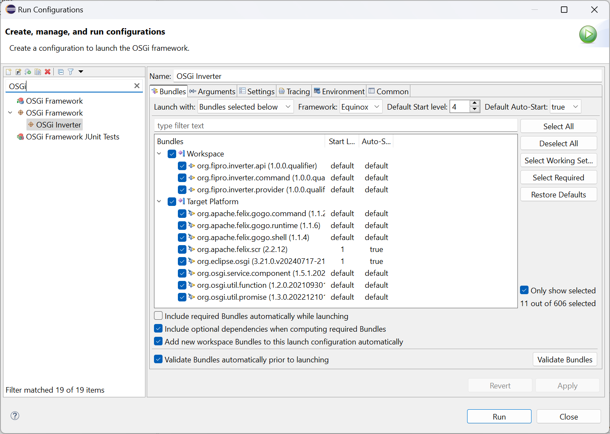

# Getting Started with OSGi Declarative Services

In 2016 I wrote the first [Getting Started with OSGi Declarative Services](https://vogella.com/blog/getting-started-with-osgi-declarative-services/) blog post and several additional blog posts about OSGi DS. It was written for developers or Eclipse RCP applications at a time when OSGi DS was not well known to them. Also the tooling support in PDE was not that good, and the usage of the annotation based programming model for OSGi services was quite new. Since then a lot happened in that area, and there are updates in the OSGi specification and the tooling. Therefore I decided to create an updated version of the initial blog post(s). Most of the information is the same, as the basics in OSGi services haven't changed. But the exercises are updated to the latest Eclipse IDE and it contains information about the [OSGi Declarative Services Specification v1.5](https://docs.osgi.org/specification/osgi.cmpn/8.1.0/service.component.html).

In this tutorial you will find an introduction to OSGi declarative services. 
What a component is and how it is created using DS annotations. 

_**Note:**_  
I will use the PDE project layout with _Automatic Manifest Generation_ that was introduced as part of PDE with Eclipse 4.28. If you are interested in using OSGi DS with the classical PDE Plug-in project layout, please have a look at the old blog post. Although even there several informations are outdated, e.g. the optional package import of `org.osgi.service.component.annotations` should not be necessary anymore, and the launch configuration is slightly different because of changes in the bundle structure.

You can expect:

- General information about OSGi Declarative Services
- The usage of Declarative Services Annotations
- A very basic comparison between PDE and Bndtools
- An introduction to the Declarative Services Specification 1.5

The tutorial is similar to the [Bndtools tutorial](http://bndtools.org/tutorial.html). Therefore we basically create three bundles:

- Service API
- Service Provider
- Service Consumer (a Felix Shell command)

If you are interested in using Bndtools and not PDE, you can read on for the general information and then move over to the [Bndtools tutorial](http://bndtools.org/tutorial.html). It is quite good to get started with Bndtools and Declarative Services. For the curious I will try to point out the differences between PDE and Bndtools. But only with regards to this tutorial. For sure Bndtools serves a lot more features, but I don't want to focus on that topic and just give an idea on the differences to start with.

## 1\. Introduction

OSGi has a layered model to provide several concepts. Mostly the _Bundles_ and _Modules_ are seen when talking about OSGi, where the focus is on modularization. But the _Services_ layer is at least as interesting as the _Bundles_ and _Modules_. Regarding OSGi services you will find the following (or similar) picture in various documentations and tutorials .

<p align="center">

</p>

Without repeating the already existing documentation, it means that a bundle _A_ can provide/publish a service implementation _S_ and another bundle _B_ can consume it. This is done by finding a service and binding to it when it is found. As there can be multiple service implementations published at the same time for the same type, and services in OSGi are dynamic and can come and go at runtime, the service consumer is listening to be able to react accordingly. This contract is implemented by the OSGi `ServiceRegistry`.

Compared with the Equinox only extension points, that are widely used in Eclipse 3.x based RCP applications, there are several advantages when using OSGi declarative services. First is the fact that multiple bundles can provide services and multiple bundles can consume them, which means there is a many-to-many relationship. In Equinox one bundle specifies an extension point and multiple bundles can contribute extensions to it, which makes it technically a one-to-many relationship. Of course you can also access the extension points of another bundle via the `ExtensionRegistry`, but conceptually this feels like a workaround compared with the general _publish-find-bind_ mechanism of OSGi services. The second fact is that you access extension points via ID, while OSGi services are retrieved by type. That means OSGi service retrieval is type-safe, while extension points are not. Further information about the comparison between extension points and OSGi services can be found here: [A Comparison of Eclipse Extensions and OSGi Services](http://www.eclipsezone.com/articles/extensions-vs-services/)

With declarative services it is not necessary to register or consume services programmatically. This needs to be done with plain OSGi services where a service is typically registered (_publish_) to the `ServiceRegistry` in an `Activator` and consumed (_find-bind_) via `ServiceTracker` (also mostly via `Activator`). Instead of this a _Service Component_ is declared via _Component Description_ when using declarative services. The _Component Description_ is an XML file that is processed by a _Service Component Runtime_ (SCR, e.g. Felix SCR) when a bundle is activated. It is responsible for managing the components and their life cycle. That means, if you want to use declarative services in your application, you need to ensure that a _Service Component Runtime_ bundle is installed and activated in your environment.

### 1.1 Components

When talking about OSGi declarative services you will always talk about components. The following list will give an overview of the necessary wordings related to components to distinguish the different parts:

1. _Service Component_  
A Java class inside a bundle that is declared via _Component Description_ and managed by a _Service Component Runtime_. Note that although we are talking about Declarative Services and _Service Components_, not every component provides a service!
3. _Component Description_  
The declaration of a _Service Component_, contained in an XML document.
5. _Component Configuration_  
A _Component Description_ that is parameterized with component properties. It is used to track the component dependencies and manages the _Component Instance_.
7. _Component Instance_  
The instance of the component implementation class. It is created when a _Component Configuration_ is activated and discarded if the _Component Configuration_ is deactivated.

As nobody wants to write XML files manually nowadays and the _Component Definition Editor_ in PDE is the worst Eclipse editor ever (which you nowadays will probably not even find anymore), it is recommended to use the Declarative Service Annotations to get the _Component Definition_ generated. I will therefore also not look at the generated XML document. If you are interested in that, have a look at the specification.

### 1.2 References to Services

Components can have dependencies on other components. If these dependencies should be managed automatically by the SCR, this is restricted to components that provide a service. Otherwise the SCR is not able to resolve the dependency.

There are different terms used when reading about service references. These terms are mostly related to the state they are in:

- _Reference_  
The definition of a dependency to another service.
- _Target Services_  
The services that match the reference interface and target property filter. They are needed to satisfy a _Component Configuration_.
- _Bound Services_  
The services that are bound to a _Component Configuration_. The binding is done on activating a _Component Configuration_.

There are different ways to access a _Bound Service_:
- _Method Injection_  
With this strategy the SCR calls _Event Methods_ when a service becomes bound, unbound or its configuration properties are updated. 
- _Field Injection_ (since DS 1.3)  
SCR modifies a field in the component instance when a service becomes bound, unbound or its configuration properties are updated.
- _Constructor Injection_ (since DS 1.4)
When SCR activates a component instance, the component instance must be constructed and constructor injection occurs. Bound services and activation objects can be parameters to the constructor.
- _Lookup Strategy_  
The bound service is located programmatically via `ComponentContext`.

I will add more detailed information on references at the end of this tutorial, with the description of the `@Reference` annotation.

### 1.3 Lifecycle

An important information regarding _Service Components_ is that they have their own lifecycle, which is contained in the life cycle of a bundle. The most important question regarding _Service Components_ is, when is it available for usage. To answer this question it is also important to know that there are basically three types of components with regards to the component life cycle:

- _Delayed Component_  
Activation is not done until there is a request for a service object. Therefore even class loading and instantiation can be delayed until that time. A _Delayed Component_ needs to specify a service.
- _Immediate Component_  
Activated as soon as its dependencies are satisfied. An _Immediate Component_ does not need to specify a service.
- _Factory Component_  
Creates and activates new _Component Configurations_ on request. The created _Component Configurations_ are not re-used if they become unsatisfied or unregistered.

Typically you find information about _Delayed Components_ when reading about OSGi Declarative Services.

The following states are possible:

- _Enabled/Disabled_  
The initial enabled state of a component is specified via _Component Description_. All components are disabled when the bundle is stopped. It is possible to change the enabled state programmatically at runtime via `CompontentContext`.
- _UNSATISFIED_  
The component is not ready to be started. See _Satisfied_ for the necessary criteria. This status can also be reached again if a component is not _Satisfied_ anymore.
- _Satisfied_  
A component is in a _Satisfied_ state when it is _enabled_ and the required referenced services are available. In case the ConfigurationAdmin is used and the `configuration-policy=required` is specified, also a configuration object needs to be available to bring a component to satisfied state.
- _REGISTERED_  
A component is in _REGISTERED_ state if it _Satisfied_ and not yet requested. Only applies for _Delayed Components_.
- _ACTIVE_  
The component was activated due to immediate activation or, in case of a _Delayed Component**,**_ it was requested.

The following images show the lifecycle of an _Immediate Component_ and a _Delayed Component_. As I will not write about _Factory Components_ here, I leave them out and come up with it in another post.

#### Immediate Component Lifecycle

<p align="center">

</p>


#### Delayed Component Lifecycle

<p align="center">

</p>


When a bundle is started, the SCR is checking if the bundle contains _Component Descriptions_. This is done via [Extender Pattern](http://enroute.osgi.org/doc/218-patterns.html), which means it searches for a Service-Component entry in the bundle MANIFEST header. If it finds one it will start to process the _Component Description_ and create a _Component Configuration._ One of the first checks is the initial _enabled_ state. Only if the _Component Configuration_ is enabled, the SCR will try to satisfy the dependencies by finding and binding the specified references. It will also try to satisfy the configuration, if that is required by the _Component Description_. That means it checks for required references and configurations if necessary. After the _Component Configuration_ is satisfied, it can be activated. An _Immediate Component_ will activate immediately, a _Delayed Component_ moves to the REGISTERED state, awaiting the first request to the provided service. If a _Component Configuration_ contains dynamic references, the references can rebind in ACTIVE state, otherwise it will be re-activated. If a _Component Configuration_ becomes unsatisfied (e.g. a bound service becomes unavailable), the _Component Configuration_ will be deactivated. Note that a _Delayed Component_ will also be deactivated and gets back to REGISTERED state in case no other bundle references it anymore.

The activation of a component and the time when it is done makes the real difference between an _Immediate_ and a _Delayed Component_. It consists of the following steps:

1. Load the component implementation class
2. Create the component instance and component context
3. Bind the target services
4. Call the activate method if present

For _Delayed Components_ the initial memory footprint and the load time is therefore delayed on startup until the first request on a service object (see [Declarative Services Specification – 112.5.6 Activation](https://docs.osgi.org/specification/osgi.cmpn/8.1.0/service.component.html#service.component-activation)).

In the above diagrams the light-blue highlighted states and state transitions indicate that a _Component Instance_ exists. Correlated to the explanation on the activation of a component, this should make it more clear where a _Component Instance_ (and therefore a real object) comes to play.

This is also a big difference to Eclipse Extension Points. While with OSGi Declarative Services and _Delayed Components_ a bundle can be safely activated without issues regarding startup performance and initial memory footprint, the policy in Equinox and Eclipse is to optimize the startup on bundle level. That means you can use Extension Points and Core Expressions to avoid starting a bundle until the first usage of an extension.

Now enough with the general basics and let's get started with the tutorial! I will place some further general information (e.g. describing the DS annotations) alongside the matching places in the tutorial and at the end.

## 2\. IDE Setup

If you are using Eclipse >= 4.28 (2023-06) and try the _Automatic Manifest Generation_, there is no need for an additional configuration.

If you use an older version of Eclipse that does not yet support the _Automatic Manifest Generation_ or you want to stick with the olde PDE plugin project layout, you need to enable the DS Annotations support. To do this open the preferences via _Window -> Preferences -> Plug-in Development ->_ _DS Annotations_ and check _Generate descriptors from annotated sources_.

<p align="center">

</p>

After that the following four configurations are available:

- Descriptor directory  
The directory to which the component description files will be generated. Default is _OSGI-INF_, and you should leave that setting unchanged.
- Specification version  
The version of the OSGi Declarative Services Specification that should be used.
- Annotation problem level  
If issues on annotation level should be reported as an _Error_, _Warning_ or to _Ignore_ them. Default is _Error_ and it is a good idea to keep that to see if the annotation is used correctly.
- Missing implicit reference unbind method  
If a missing unbind method for a service reference should be reported as an _Error_, _Warning_ or to _Ignore_ them. The default is _Error_. The DS specification does not require an unbind method, but it is strongly suggested in case of dynamic references that are stored locally.
- Generate header "Bundle-ActivationPolicy: lazy"  
If this setting is enabled, the bundle manifest header will be generated. The default is enabled, and it should be enabled in case Equinox is used as OSGi framework.

### Bndtools vs. PDE

The difference to Bndtools, well you need to [install Bndtools](https://bndtools.org/installation.html) into your Eclipse installation. And there is no need to configure the annotation processing separately. This is also not necessary with the _Automatic Manifest Generation_ in PDE, which makes it much easier to use DS with PDE nowadays.

### Interlude: Bundle-ActivationPolicy: lazy

The [Lazy Activation Policy](https://www.osgi.org/developer/design/lazy-start/) that is configured via _Bundle-ActivationPolicy_, is a bundle life cycle policy that tells the OSGi framework that a bundle should be lazily activated when the first successful class load is made from its local class space. From my research I've found out that this policy is typically not used when working with other OSGi frameworks. Apache Felix or Eclipse Concierge for example can be configured to automatically install and start all bundles in a specified directory. Also Equinox can be configured to automatically install and start all bundles, but that needs to be explicitly configured for every bundle itself. The default [Eclipse Configurator](https://wiki.eclipse.org/Configurator), currently SimpleConfigurator and the deprecated update configurator, only install all bundles in the _plugins_ directory but doesn't start them. By specifying the Lazy Activation Policy you basically specify an auto-start behavior for bundles without the need to specify the auto-start manually in a launch configuration. As you typically don't specify an auto-start for every bundle that provides service implementations via DS, the lazy activation policy is mandatory in Eclipse with Equinox to be sure that the service implementation is available. Otherwise the bundle that provides the service might never be started. The main idea behind not automatically starting all bundles was to reduce the startup time by reducing the number of bundles to activate. From my understanding the startup performance issues in the past (when that policy was added) where related to ineffectively implemented bundle activators. If you follow the best practices in OSGi development and use declarative services, you shouldn't use _Activators_ at all. The bundle startup should take almost no time and the component activation can be delayed to the first request (see lifecycle above). There should be only rare cases where you can't use _Service Components_ and an _Activator_ is really needed.

## 3\. API Project

Let's start with the tutorial by specifying the service API. This is typically done in a separate API project to decouple the service contract and the service implementation, which makes it possible to exchange or provide multiple implementations for a service.

I recently heard the remark that it is "old-school" to always create an interface if there is only one implementation. But regarding a service-oriented-design you should always consider using interfaces and even separate the interfaces in an API bundle. Even if you only see one implementation, consider the following two statements:

1. Don't forget testing!  
By separating API and implementation you can simply create a test implementation of a service that is provided by a separate bundle. Especially for UI testing you can deploy the bundle with the test implementation of a service instead of deploying the real service implementation that needs to be mocked in test execution.
2. Clean dependency hierarchies  
An API should typically have no or at least little dependencies to other libraries. Only implementations should have such dependencies. If the API without additional third-party-depencies is separated in an API bundle, and a service consumer only depends on the API, the consumer also has a simpler dependency graph.

Regarding _Service Components_ that provide a service it is therefore always recommended to have the API in a separate bundle. For sure there are also exceptions to that rule, e.g. _Immediate Components_ that are used for initial configuration or used to open a socket for communication.

### 3.1 Create an API project

In the _Plug-in Development Perspective_ 

- Create a new plug-in project
    - _Main Menu → File → New → Plug-in Project_
    - Set name to _org.fipro.inverter.api_
    - In the _Target Platform_ section select
        - This plug-in is targeted to run with: __*an OSGi framework:*__
        - Select __*standard*__ in the combobox
        - Check __*Generate OSGi metadata automatically*__  
        <p align="center">
        
        </p>
    - Click _Next_
    - Set _Name_ to _Inverter Service API_
    - Select _Execution Environment JavaSE-17_
    - Ensure that _Generate an Activator_ and _This plug-in will make contributions to the UI_ are disabled
        <p align="center">
        
        </p>
    - Click _Finish_
    - If you do not see the tabs at the bottom of the recently opened editor with name _org.fipro.inverter.api_, close the editor and open the  _pde.bnd_ file in the project _org.fipro.inverter.api_.
        - Switch to the _pde.bnd_ tab
          - Add the `-runee` instruction to create the requirement on Java 17
            ```
            Bundle-Name: Inverter Service API
            Bundle-SymbolicName: org.fipro.inverter.api
            Bundle-Vendor: 
            Bundle-Version: 1.0.0.qualifier
            -runee: JavaSE-17
            ```

_**Note:**_  
You can add additional headers like `Automatic-Module-Name: org.fipro.inverter.api` and instructions like `-runee: JavaSE-17` to the _pde.bnd_ file. This has effect on the generation of the _MANIFEST.MF_ file. For this example they are not necessary. The list of OSGi manifest headers can be found in [bnd - Headers](https://bnd.bndtools.org/chapters/800-headers.html) and the list of possible instructions is available in the [bnd - Instruction Index](https://bnd.bndtools.org/chapters/825-instructions-ref.html). 

### 3.2 Specify the API

  - Create an interface for the service definition
    - _Main Menu → File → New → Interface_
        - Source Folder: _org.fipro.inverter.api/src_
        - Package: _org.fipro.inverter_
        - Name: _StringInverter_
    - Add the method definition `String invert(String input);`

``` java
    package org.fipro.inverter;

    public interface StringInverter {

        String invert(String input);

    }
```

__*Hint:*__  
You can also copy the above snippet and paste it in Eclipse when having the `src` folder of the project selected in the _Project Explorer_. This will automatically create the package and the source file at the correct place. 

- Create the _package-info.java_ file in the `org.fipro.inverter` package.
    - _Right click on the package `org.fipro.inverter` → New → File_
    - Set _File name_ to _package-info.java_
    - Click _Finish_
    - Copy the following code into the editor and save the file

    ```java
    @org.osgi.annotation.bundle.Export(substitution = org.osgi.annotation.bundle.Export.Substitution.NOIMPORT)
    @org.osgi.annotation.versioning.Version("1.0.0")
    package org.fipro.inverter;
    ```

    This configures that the package is exported. If this file is missing, the package is a `Private-Package` and therefore not usable by other OSGi bundles. The `substitution` parameter avoids that the package is used as import inside the same bundle.

### Bndtools vs. PDE

With Bndtools you create a _Bnd OSGi Project_. Additionally you need to create a configuration project if you don't have one yet. Typically this is called the _cnf_ project that contains workspace-wide configurations, like the repositories that are used to resolve the dependencies. They have their own workspace concept additionally to the Eclipse workspace, and they have [workspace templates](https://bnd.bndtools.org/chapters/620-template-fragments.html) that help with the creation.

PDE uses the concept of a Target Platform, where you specify the repositories and the bundles that are used to create an application. The target platform typically contains p2 repositories and the Eclipse IDE itself can be used as target platform for the development. In a professional environment you typically create a project specific target definition in a separate project (I explained that in my [basic recipe](https://github.com/fipro78/e4-cookbook-basic-recipe/blob/master/tutorials/Eclipse_RCP_Cookbook_Basic_Recipe.md)). So conceptually the usage of a repository or configuration project is similar when comparing PDE and Bndtools. But as Bndtools doesn't support p2 and the target platform concept of PDE, the _cnf_ project is different and required for OSGi development with Bndtools.

In Bndtools you configure the bundle in the _bnd.bnd_ file. With the _Automatic Manifest Generation_ PDE project layout, you also configure the bundle in a _.bnd_ file. So the project layouts are similar. All informations for the bundle are configured there, like dependencies, bundle version and bundle symbolic name for example. The _MANIFEST.MF_ file is generated with the correct information. The creation of the _MANIFEST.MF_ file is a major advantage of Bndtools compared to a classical PDE project layout, where the _MANIFEST.MF_ needs to be created and maintained manually, as this is one of the more complicated things regarding OSGi.

Another difference is that the resulting bundle JAR file is automatically generated. After saving the _bnd.bnd_ file, the bundle jar is available for usage in the _generated_ folder.

### Interlude: Project Layout Migration

The following sections describe how to create new OSGi bundle projects with the _Automatic Manifest Generation_ project layout. If you have an existing project in the classical PDE plug-in project layout, you can also use a wizard to convert it to the _Automatic Manifest Generation_ project layout.

- _Right click on project → Plug-in Tools → Convert to Automatic Manifest Generation..._
- Configure how the project should be migrated (or keep the defaults)
  <p align="center">
  
  </p>
- Click _Finish_

The resulting _pde.bnd_ file might contain more information than necessary. For example the _Component Descriptor_ XML files that were generated by the DS Annotation Support still exist and are referenced. If you used DS annotations, these files can be safely deleted and the `Service-Component` entry in the _pde.bnd_ can be removed.

## 4\. Service Provider

After the API bundle is specified, a service provider bundle with a service implementation can be created.

### 4.1. Create and configure the service provider bundle

In the Plug-in Perspective create a new Plug-in Project via _File -> New -> Plug-in Project_. Choose a name that indicates that this is a bundle that provides a service implementation (e.g. _org.fipro.inverter.provider_), and on the following wizard page ensure that no Activator is generated, no UI contributions will be added and that no Rich Client Application is created. The steps are the same as for creating the API bundle.

- Create a new plug-in project
    - _Main Menu → File → New → Plug-in Project_
    - Set name to _org.fipro.inverter.provider_
    - In the _Target Platform_ section select
        - This plug-in is targeted to run with: __*an OSGi framework:*__
        - Select __*standard*__ in the combobox
        - Check __*Generate OSGi metadata automatically*__  
    - Click _Next_
    - Set _Name_ to _Inverter Provider_
    - Select _Execution Environment JavaSE-17_
    - Ensure that _Generate an Activator_ and _This plug-in will make contributions to the UI_ are disabled
    - Click _Finish_
    - If you do not see the tabs at the bottom of the recently opened editor with name _org.fipro.inverter.provider_, close the editor and open the  _pde.bnd_ file in the project _org.fipro.inverter.provider_.
        - Switch to the _pde.bnd_ tab
            - Add the `Bundle-ActivationPolicy` to get the bundle automatically started in an Equinox runtime
            - Add the `-runee` instruction to create the requirement on Java 17
            - Add the `-buildpath` instruction to specify the dependency to the API bundle
            ```
            Bundle-Name: Inverter Provider
            Bundle-SymbolicName: org.fipro.inverter.provider
            Bundle-Vendor: 
            Bundle-Version: 1.0.0.qualifier
            Bundle-ActivationPolicy: lazy
            -runee: JavaSE-17
            -buildpath: \
                org.fipro.inverter.api
            ```

_**Note:**_  
Although there is a _Dependencies_ tab for the opened _pde.bnd_ editor, you should not manage the dependencies there. Changes result in additional `Require-Bundle` or `Import-Package` statements in the _pde.bnd_ file, or even cause errors. You should always use the `-buildpath` instruction to add build-time dependencies.

_**Note:**_  
In Eclipse projects you also often find bundle names that end with _.impl_ instead of _.provider_. IMHO suffixing such bundles with ._provider_ makes more sense, but in the end it is a project decision.

### 4.2 Create the service implementation

- _Main Menu → File → New → Class_
    - Source Folder: _org.fipro.inverter.provider/src_
    - Package: _org.fipro.inverter.provider_
    - Name: _StringInverterImpl_
    - Interfaces: _org.fipro.inverter.StringInverter_
- Implement the method `String invert(String);`
- Add the `org.osgi.service.component.annotations.Component` annotation on the class

``` java
package org.fipro.inverter.provider;

import org.fipro.inverter.StringInverter;
import org.osgi.service.component.annotations.Component;

@Component
public class StringInverterImpl implements StringInverter {

    @Override
    public String invert(String input) {
        return new StringBuilder(input).reverse().toString();
    }
}
```

The usage of the `@Component` annotation is the important thing in this step. It is to identify the class as a _Service Component_ and is used to generate the _Component Description_.

_**Note:**_  
With the classical PDE plug-in project layout, the usage of the `@Component` annotation triggers the generation of the _Component Description_ on save (if you have the DS Annotations Support enabled). You will find the XML file in the _OSGI-INF_ folder in the _org.fipro.inverter.provider_ project, which also has been created if it didn't exist before (note that in PDE the file is also called Component Definition, just in case you are getting confused by names). It also updates the _MANIFEST.MF_ file by adding (or updating) the _Service-Component_ header to point to the _Component Description._ This is necessary for the SCR to find, load and process the _Component Description_.  The _build.properties_ file is updated aswell to include the _Component Description_ file. Unfortunately this generates a warning saying the _OSGI-INF_ folder itself is not included. To remove that warning you can simply open the _build.properties_ file and add the _OSGI-INF_ folder itself. This is at least sufficient for this simple example.

There is nothing more to do at this point. You will find a more detailed description on the `@Component` annotation at the end of this tutorial.

**Note:**  
The fact that after code generation warnings are shown is IMHO really annoying. I suggested to always add the whole _OSGI-INF_ folder to the _build.properties_, but this was declined with the comment that not everybody wants to always add all files in that folder to the resulting bundle JAR. This is of course a valid remark. I therefore created another ticket to either rethink that warning (not sure if that warning is really valid) or if it should be possible to disable that warning somehow. There has been no action on that topic while writing this tutorial, but you can follow the discussion in [Bug 491666](https://bugs.eclipse.org/bugs/show_bug.cgi?id=491666).

### Bndtools vs. PDE

- With Bndtools you create a new _Bnd OSGi Project_ with a _Provider Bundle_ template for example.
- Dependencies are managed via the _bnd.bnd_ file. If you open that file with the _Bnd Project Editor_, you can add the build time dependency to the API bundle on the _Build_ tab in the _Build Path_ section, which will be used to calculate the necessary imports in the _MANIFEST.MF_ file.

As explained before, the advantage is clearly the generation of the OSGi meta-data in the _MANIFEST.MF_ file.

### Interlude: Capabilities

There is no need to specify a bundle dependency to the SCR on package level. But without specifying such a dependency, the OSGi framework doesn't know about that dependency when resolving the provider bundle. As we don't need to import a package from an SCR implementation, we need another way to specify the dependency. In OSGi this is done via [Requirements and Capabilities](http://blog.osgi.org/2015/12/using-requirements-and-capabilities.html). Since the **DS 1.3** specification the SCR needs to provide the following capability:

```
Provide-Capability: osgi.extender;
 osgi.extender="osgi.component";
 version:Version="1.3";
 uses:="org.osgi.service.component"
```

A provider bundle can require the _osgi.extender_ capability which wires the bundle to the SCR implementation and ensures that both use the same version of the _org.osgi.service.component_ package. This can be done by adding the following header to the bundle MANIFEST.

```
Require-Capability: osgi.extender;
 filter:="(&(osgi.extender=osgi.component)(version>=1.3)(!(version>=2.0)))"
```

**Note:**  
The PDE _Plug-in Manifest Editor_ has not build in support for specifying capabilities. You therefore have to add that header in the _MANIFEST.MF_ source tab manually if you use the classical PDE plug-in project layout.

You could also provide the _osgi.service_ capability to make consumers able to declare a dependency on the service that is provided. As per specification this would look like the following snippet for the service of this tutorial:

```
Provide-Capability: osgi.service;
 objectClass:List<String>="org.fipro.inverter.StringInverter"
```

On the consumer side you could then require the _osgi.service_ capability like this:

```
Require-Capability: osgi.service;
 filter:="(objectClass=org.fipro.inverter.StringInverter)";effective:=active
```

You should notice the `effective:=active` directive here. It is necessary so the OSGi Framework will resolve the bundle without checking if another bundle provides that capability. Without that directive or setting `effective:=resolve` the resolution of the bundle would be prevented. 

Of course, using the _Automatic Manifest Generation_ the capability headers are also generated. You can verify this by opening the _pde.bnd_ files of the generated projects and open the _MANIFEST.MF_ tab.

### Bndtools vs. PDE

With Bndtools the capability headers are automatically generated. It always provides the _osgi.service_ capability. And it will require the _osgi.extender_ capability in case the component XML file is generated for DS spec 1.3.

## 5\. Service Consumer

To show that our service is working, we need to implement a consumer. As an Eclipse developer it would be natural to create a small Eclipse RCP application for that. But I want to stick to the Bndtools tutorial and just create a console command for that. This is also easier to achieve without adding Eclipse RCP specifics to this tutorial.

**Note:**  
The Eclipse OSGi console is based on the Felix Gogo Shell. We can therefore easily use the same approach for creating a console command as shown in the Bndtools tutorial.

### 5.1 Create and configure the service consumer bundle

- Create a new plug-in project
    - _Main Menu → File → New → Plug-in Project_
    - Set name to _org.fipro.inverter.command_
    - In the _Target Platform_ section select
        - This plug-in is targeted to run with: __*an OSGi framework:*__
        - Select __*standard*__ in the combobox
        - Check __*Generate OSGi metadata automatically*__  
    - Click _Next_
    - Set _Name_ to _Inverter Command_
    - Select _Execution Environment JavaSE-17_
    - Ensure that _Generate an Activator_ and _This plug-in will make contributions to the UI_ are disabled
    - Click _Finish_
    - If you do not see the tabs at the bottom of the recently opened editor with name _org.fipro.inverter.command_, close the editor and open the  _pde.bnd_ file in the project _org.fipro.inverter.command_.
        - Switch to the _pde.bnd_ tab
            - Add the `Bundle-ActivationPolicy` to get the bundle automatically started in an Equinox runtime
            - Add the `-runee` instruction to create the requirement on Java 17
            - Add the `-buildpath` instruction to specify the dependency to the API bundle
            ```
            Bundle-Name: Inverter Command
            Bundle-SymbolicName: org.fipro.inverter.command
            Bundle-Vendor: 
            Bundle-Version: 1.0.0.qualifier
            Bundle-ActivationPolicy: lazy
            -runee: JavaSE-17
            -buildpath: \
                org.fipro.inverter.api
            ```

### 5.2 Create the service consumer class

- _Main Menu → File → New → Class_
    - Source Folder: _org.fipro.inverter.command/src_
    - Package: _org.fipro.inverter.command_
    - Name: _StringInverterCommand_
- Add the `org.osgi.service.component.annotations.Component` annotation on the class
  - Specify configuration properties that are needed for the configuration of the command: `osgi.command.scope` and `osgi.command.function`, so our command can be triggered by executing _fipro:invert_ on the console. The method that gets triggered needs to have the same as the configured function property (`invert` in our case).
  - Specify the `service` attribute to register the command as a service. The component would be otherwise an _Immediate Component_, because we don't implement an interface.
- Consume a `StringInverter` via dependency injection.
  - Add a member `inverter` of type `StringInverter` and use the `@Reference` annotation on that field to bind to the service via _Field Injection_
- Implement the method `void invert(String);`

``` java
package org.fipro.inverter.command;

import org.fipro.inverter.StringInverter;
import org.osgi.service.component.annotations.Component;
import org.osgi.service.component.annotations.Reference;

@Component(
    property= {
        "osgi.command.scope::String=fipro",
        "osgi.command.function:String=invert"
    },
    service=StringInverterCommand.class
)
public class StringInverterCommand {

    @Reference
    private StringInverter inverter;

    public void invert(String input) {
        System.out.println(inverter.invert(input));
    }
}
```

Further information on the annotations can be found at the end of the tutorial.

### Bndtools vs. PDE

In the _bnd.bnd_ file of the command project you need to switch to the _Build_ tab and add

- _org.fipro.inverter.api_

## 6\. Run

Now that our bundles are ready we can launch an OSGi application to test it. For this create a launch configuration, to be able to start directly from the IDE.

- _Main Menu → Run -> Run Configurations..._
- In the tree view, right click on the _OSGi Framework_ node and select _New_ from the context menu
- Specify a name, e.g. _OSGi Inverter_
- _Bundles_ tab
  - Click _Deselect All_
  - Select the following bundles
      - _org.fipro.inverter.api_
      - _org.fipro.inverter.command_
      - _org.fipro.inverter.provider_
      - _org.apache.felix.gogo.command_
      - _org.apache.felix.gogo.runtime_
      - _org.apache.felix.gogo.shell_
      - _org.apache.felix.scr_
      - _org.eclipse.osgi_
      - _org.osgi.service.component_
      - _org.osgi.util.function_
      - _org.osgi.util.promise_
  - Ensure that _Default Auto-Start_ is set to _true_
  <p align="center">
  
  </p>
- _Arguments_ tab
  - Remove `-consoleLog -console` from the _Program Arguments_
  - Add `-Dosgi.console=` to the _VM Arguments_
  <p align="center">
  
  </p>
- Click _Run_

The Console view should open with a _g!_ prompt. Now you can type in the _invert_ command with a parameter and see the result. Note that it is not necessary to specify the scope here, because there is no other _invert_ command published.

The result should look similar to this:

```console
g! invert Simpson
nospmiS
g! 
```

_**Note:**_  
The Eclipse Launcher has also a feature that allows to only configure the minimal set of bundles and let the additionally required bundles be resolved automatically. This makes it much more comfortable to create a _Run Configuration_ but could also result in having more bundles in the runtime than needed.

<p align="center">

</p>

### Bndtools vs. PDE

You will find a _launch.bndrun_ file in the command bundle project, that can be used to launch our small OSGi application. The _OSGi Framework_ and the _Execution Environment_ needs to be selected and the _org.fipro.\*_ bundles need to be added to the _Run Requirements_. Click on _Resolve_ so the _Run Bundles_ are automatically determined. After that you simply click on _Run OSGi_ in the upper right corner of the editor and the application starts up, opening the Console view for interaction.

The creation of the launch configuration in Bndtools feels more comfortable than the one with PDE. On the other hand I had sometimes strange issues with that editor. It sometimes forgot my changes in the _Run_ tab on save, which left me editing the launch configuration in the Source tab directly. This happened mostly when trying to create a launch configuration with Equinox as _OSGi Framework_.

## 7\. DS Annotations

That's it with the tutorial. Now let's have a closer look at the DS annotations.

### 7.1 @Component

Let's start with the `@Component` annotation. It is the first _Declarative Service Annotation_ we used. It indicates that the annotated class is intended to be an OSGi component and triggers the generation of the _Configuration Description_ as explained above. If nothing else is specified, the annotation defaults will create the easiest to use component:

- Its name is the full qualified class name
- It registers all of the class's directly implemented interfaces as services
- The instance will be shared by all bundles
- It is enabled
- It is immediate if it has no services, otherwise it is delayed
- It has an optional configuration policy
- The configuration PID is the full qualified class name

These defaults can be changed via annotation type elements (or annotation parameter if that is better understandable). The following elements are supported by the `@Component` annotation:

| **Annotation Type Element** | **Description** |
| --- | --- |
| configurationPid | The configuration PID that is used for the configuration of the component in conjunction with the ConfigurationAdmin. |
| configurationPolicy | Configure whether a configuration object for the component needs to be present via ConfigurationAdmin. |
| enabled | The initial enabled state of the component when the containing bundle is started. |
| factory | The factory identifier for this component, indicating that this component is a _Factory Component_. |
| immediate | Control whether a component configuration should be immediately activated after becoming satisfied or if the activation should be delayed. Needs to be `false` in case the factory attribute is set also, needs to be `true` if no service is provided. |
| name | The name of the component which needs to be unique within a bundle. |
| properties | References a _Java Properties File_ entry in the bundle. The entry is read and processed to obtain the properties and their values. |
| property | Array of Strings to specify a set of component properties. Can be seen as additional meta-information of a component that is used for configuration. It is a number of key-value pairs in the format _\<name\>(:\<type\>)?=\<value\>_ where the type information is optional and defaults to String. The following example defines a property with key _answer_ and an `Integer` value 42: _answer:Integer=42_ |
| service | The name(s) of the interface or class this component is registered under as a service. Needs to be a full qualified class name. |
| servicefactory | By setting this value to true, a new _Component Instance_ will be created for each distinct bundle that request the service. Note: this element is replaced by _scope_ with DS 1.3 |
| xmlns | The XML name space of the _Component Description_ for this component. By default the lowest Declarative Services XML name space is used, that supports all the specification features used by this component. |

**Note:**  
The configuration related type elements will be explained in an upcoming post that will focus on the ConfigurationAdmin.

With **DS 1.3** the following elements were added to the `@Component` annotation:

| **Annotation Type Element** | **Description** |
| --- | --- |
| reference | Array of `@Reference` annotations with specified name and service elements. Used to accesss references via _Lookup Strategy_. |
| scope | The scope of the provided service. SINGLETON by default which means the _Component Instance_ will be used by all bundles. BUNDLE if every bundle should get its own _Component Instance_. PROTOTYPE to create a new _Component Instance_ for each distinct request. Note: This element replaces the _servicefactory_ element. |

With **DS 1.4** the following elements were added to the `@Component` annotation:

| **Annotation Type Element** | **Description** |
| --- | --- |
| factoryProperty | Array of Strings to specify a set of factory properties for a _Factory Component_. |
| factoryProperties | References a _Java Properties File_ entry in the bundle. The entry is read and processed to obtain the factory properties and their values. |

### 7.2 @Activate, @Deactivate, @Modified

Although we don't use them in the example, I want to show and explain the life cycle annotations. A component can specify methods that should be called when a life cycle event happens. This is the activation, modification or deactivation of a component. Using the DS annotations you can mark a method as such a life cycle method.

| **Annotation** | **Description** |
| --- | --- |
| `@Activate` | The method that should be called on component activation. |
| `@Modified` | The method that should be called if a configuration is updated using the ConfigurationAdmin. |
| `@Deactivate` | The method that should be called on component deactivation. |

These methods can have zero or more arguments, where each argument must be one of the following types:

- `ComponentContext`  
The component context for the component configuration.
- `BundleContext`  
The bundle context of the components bundle.
- `Map<String, ?>`  
An unmodifiable map containing the component properties.

The following snippet is an example for an activate method that takes all supported parameters:

``` java
@Activate
private void activate(
    ComponentContext c,
    BundleContext b,
    Map<String, ?> properties) {

    //do some initialization stuff
}
```

`@Deactivate` accepts an additional `int` or `Integer` parameter for the deactivation reason. The different deactivation reasons are specified in `org.osgi.service.component.ComponentConstants` which is contained in the SCR implementation.

With **DS 1.3** there is an additional parameter type that is accepted by the life cycle methods. It is called a _Component Property Type_, which allows type safe access to component properties. You can also access the component properties via the Map parameter, but in an unsafe manner. You need to check the type and cast accordingly. As the component properties can come from anywhere (specified via `@Component` _property_ or _properties_ element, via ConfigurationAdmin or factory component) it is nicer to have a type safe access via _Component Property Type_, as the framework will do the conversion. As this tutorial is about getting started with Declarative Services, I will not cover this here in more detail. Have a look at the [Configuring OSGi Declarative Services](configuring-osgi-declarative-services.md) blog post for further information.

Note that you can only use each annotation once in your component implementation. There is no overriding capability but a strict order which method will be chosen in such a case. I therefore suggest to only add one method per life cycle annotation and choose the parameter list that matches the best.

The OSGi best practices suggest to not use the public access modifier for the life cycle methods. They are only intended to be called by the SCR and should not be called from other code.

With **DS 1.4** the `@Activate` annotation can also be used to 
- Get the _activation objects_ via field injection
  ```java
  @Activate
  private ComponentContext c;
  @Activate
  private BundleContext b;
  @Activate
  private Map<String, Object> properties;
  ```
- Mark a constructor to be used by SCR for _Constructor Injection_

### 7.3 @Reference

The last available annotation is `@Reference`. It is used to specify the dependency on other services. With DS 1.2 it can only be used with _Event Methods_. **DS 1.3** also introduced the usage of `@Reference` on fields and the type element _reference_ of `@Component`. Since **DS 1.4** it is also possible to use `@Reference` on parameters of a constructor to support _Constructor Injection_.

Let's first explain _Event Methods_. An _Event Method_ is called by the SCR when a service becomes bound, unbound or its configuration properties are updated. With DS 1.2 it is necessary to bind a service reference via _bind_ event method. With DS 1.3 _Event Methods_ are still useful in case actions need to be performed if a service is bound, unbound or changes its configuration. There are three _Event Methods_ per service reference:

- _bind_  
Called to bind a new service to the component. For static references this method is called before the activate method. For dynamic references this method can also be called while the component is active.
- _updated_  
Called when the configuration properties of a bound service are modified.
- _unbind_  
Called when the SCR needs to unbind the service. For static references this method is called after the deactivate method. For dynamic references this method can also be called while the component is active.

With DS 1.2 the _bind_ method is mandatory to specify the reference. The _updated_ and _unbind_ methods are optional as per specification, although specifying the _unbind_ method is often recommended (see below).

The `@Reference` annotation needs to be applied on the _bind_ event method. The following defaults are used in that case:

- The name of the _bind_ method is used for the name of the reference. That means the method name after the prefix (e.g. `setStringInverter()` -> _StringInverter_). Mind the case sensitivity, as the name in that case starts with an upper case letter.
- 1:1 cardinality.
- Static reluctant policy.
- The requested service is the type of the first argument of the bind method.
- It will infer a default _unset_ method and _updated_ method based on the name of the _bind_ method.

The defaults can be changed via annotation type elements, which will be explained shortly.

**Note:**  
When using _Event Methods_ for reference binding, typically the _bind_ method is used to store the service reference instance in a field. In case of a dynamic reference there should be **always** an _unbind_ method to clean up such a reference. This is necessary as for dynamic references the reference binding/unbinding can happen while the _Component Configuration_ is ACTIVE. The _unbind_ method is not necessary for static references, as a _Component Configuration_ would be deactivated if the bound service is not available anymore, and activated again if another target service could be bound.

_Event Methods_ accept different parameters. With DS 1.2 these can be:

- `ServiceReference`  
The service reference to the bound service, which can later be used for the _Lookup Strategy_.
- Service Type  
The type of the referenced service, so the Service Instance itself is passed.
- Service Type + `Map<String, ?>`  
The Service Instance itself is passed together with the unmodifyable map that contains the configuration properties of the bound service.

The following snippet shows the _bind_ method for the `StringInverter` reference, that also takes the configuration properties as parameter:

``` java
@Reference
void bindStringInverter(
        StringInverter inverter, Map<String, ?> properties) {
    // check the properties for some initialization
    this.inverter = inverter;
}
```

The _bind_ event methods are typically prefixed with either _bind_, _set_ or _add_. The _unbind_ method should have the corresponding prefixes _unbind_, _unset_ or _remove_, so they are automatically picked up by `@Reference`. The _updated_ event method follows that principle by replacing the bind prefix with _updated_. Alternatively it is possible to explicitly specify the _unbind_ and the _updated_ event methods via type element.

With **DS 1.3** an additional parameter is supported for usage with the PROTOTYPE scope, `ComponentServiceObjects`. Also additional parameter combinations are supported with DS 1.3. So it is for example possible to only get the map of configuration properties injected, or a combination of `ServiceReference`, Service Type, `ComponentServiceObjects` and the map of configuration properties. Additional information about scopes and `ComponentServiceObjects` in DS 1.3 can be found in my [Control OSGi DS Component Instances](https://vogella.com/blog/control-osgi-ds-component-instances/) blog post.

Also introduced with **DS 1.3** is the _Field Strategy_ for binding services. With this it is not necessary to specify a _bind_ event method for a reference. Instead it is possible to apply the `@Reference` annotation to a field in the component implementation class. For a static reference the field will be set before the component instance is activated. Dynamic references need to be marked as `volatile` so that changes to that field are also visible to other threads.

When applying `@Reference` on a field, the following defaults are used:

- The name of the field is used for the name of the reference.
- 1:1 cardinality if the field is not a collection. 0..n cardinality if the field is a collection.
- Static reluctant policy if the field is not declared `volatile`. Dynamic reluctant policy if the field is declared `volatile`.
- The requested service is the type of the field in case the field type is a service type.

The `@Reference` annotation can be applied to different field types. The following list shows the supported types for references with unary cardinality:

- Service Type  
The type of the referenced service, so the Service Instance itself is passed.
- `ServiceReference`  
The service reference to the bound service, which can later be used for the _Lookup Strategy_.
- `ComponentServiceObjects`  
The actual service object or objects for services with prototype scope.
- `Map<String, ?>`  
The unmodifyable map that contains the configuration properties of the bound service.
- `Map.Entry<Map<String, ?>, Service Type>`  
An unmodifiable `Map.Entry` whose key is an unmodifiable Map containing the service properties of the bound service, as above, and whose value is the bound service object.

The cardinality of the reference is determined by the field type. If multiple service references should be bound (or at least one service reference) one of the following types needs to be used, where the type of objects in the collection can be one of the above:

- `Collection`
- `List`
- A subtype of `Collection`  
This can only be used for dynamic references using the UPDATE _field-option_. The collection object needs to be initialized in the component instances constructor.

**Note:**  
Only instance fields are supported. The `@Reference` annotation can not be applied to `static` fields.

Since **DS 1.4** the `@Reference` annotation can also be used for _Constructor Injection_ when it is applied to a constructor parameter.

Since **DS 1.5** it is possible to use `Optional` to hold unary references for field and constructor injection. This is primarily for optional (0..1) cardinality but can also be used with mandatory (1..1) cardinality. And it is possible to use the special interface name `org.osgi.service.component.AnyService` to select the target services. This means that a service type is not used to select the target services and just the _target_ property is used to select the target services. When the special interface name of `org.osgi.service.component.AnyService` is used, a target property must be present to constrain the target services to some subset of all available services. A more detailed description on this can be found in the [Configuring OSGi Declarative Services](configuring-osgi-declarative-services.md) blog post.

There are various options to configure service references. The following annotation type elements are supported by the `@Reference` annotation for configuration:

| **Annotation Type Element** | **Description** |
| --- | --- |
| cardinality | Specify if the reference is optional and if single or multiple bound services are supported. Supported values are specified in the `ReferenceCardinality` enum: <ul><li>0..1 = OPTIONAL</li> <li>1..1 = MANDATORY</li> <li>0..n = MULTIPLE</li> <li>1..n = AT\_LEAST\_ONE</li></ul> |
| name | The component local name of the reference which can be used for the _Lookup Strategy_. |
| policy | The reference policy regarding dynamicity. Supported values are specified in the `ReferencePolicy` enum: <ul><li> STATIC<br/>The component instance doesn't see any dynamics. Dependent on the policy-option it is either ignored that a new or higher ranking service becomes available, or the _Component Configuration_ is deactivated and reactivated.</li> <li>DYNAMIC<br/>The SCR can change the set of bound services without deactivating the _Component Configuration_.</li></ul> |
| policyOption | Specify the binding behavior when a new, potentially with a higher ranking, target service becomes available. Supported values are specified via `ReferencePolicyOption` enum:<ul><li>RELUCTANT<br/>In case of OPTIONAL or MANDATORY cardinality, the new service is ignored for both STATIC and DYNAMIC policy (except if a service comes up for an OPTIONAL reference that is not bound yet). In case of MULTIPLE or AT\_LEAST\_ONE cardinality, the new service is ignored for the STATIC policy, and simply bound with the DYNAMIC policy.</li> <li>GREEDY<br/>In case of STATIC references a new service causes reactivation for any cardinality. In case of DYNAMIC references a binding is triggered. For OPTIONAL and MANDATORY this means rebinding in case there is already a bound service.</li></ul> |
| service | The full qualified class name of the referenced service. Typically this type element is not specified manually! |
| target | OSGi Framework filter expression to constrain the set of target services. It uses the [LDAP Filter Syntax](http://www.ldapexplorer.com/en/manual/109010000-ldap-filter-syntax.htm) and is empty by default. |
| unbind | The name of the unbind method. |
| updated | The name of the updated event method, which is used to notify that a bound service has modified its  properties. |

With **DS 1.3** the following element types are added:

| **Annotation Type Element** | **Description** |
| --- | --- |
| bind | The name of the bind event method. Can be used to combine _Field Strategy_ and _Event Strategy_, for example to only get the configuration properties map in the bind method. |
| field | The name of the field in the component implementation class that is used to hold the bound services. Typically this type element is not specified manually! |
| fieldOption | Specify how the field value needs to be managed with the _Field Strategy_. Supported values are specified via `FieldOption` enum:<ul><li>REPLACE<br/>SCR must set the field value. Values set by the constructor are overwritten. This is the default value. Static references and unary dynamic references must use this option.</li> <li>UPDATE<br/>SCR must update the collection set in the field. It will update the content, not replace the collection instance. This way it is possible to choose the `Collection` implementation that should be used to track the service references. Can only be used for dynamic references with MULTIPLE or AT\_LEAST\_ONE cardinality.</li></ul> |
| scope |  The reference scope for this reference. Supported values are specified via `ReferenceScope` enum:<ul><li>BUNDLE<br/>All activated components within a bundle must uses the same service object.</li> <li>PROTOTYPE<br/>Each activated component instance may use a single, distinct service object.</li> <li>PROTOTYPE\_REQUIRED<br/>Each activated component instance must use a single, distinct service object.</li></ul> |

With **DS 1.4** the following element types are added:

| **Annotation Type Element** | **Description** |
| --- | --- |
| parameter | The zero-based parameter number of the constructor parameter for this reference. |
| collectionType | The collection type for this reference. |

**Note:**  
The so called _Target Property_ of a reference, to filter by properties additionally to the service interface, can also be configured dynamically via ConfigurationAdmin, which I will cover in a follow up blog post.

At last here are some snippets to show the usage of `@Reference` with different techniques:

#### Event Strategy / Method Injection

``` java
@Component(
    property= {
        "osgi.command.scope:String=fipro",
        "osgi.command.function:String=invert"},
    service=StringInverterCommand.class
)
public class StringInverterCommand {

    private StringInverter inverter;

    @Reference
    void setStringInverter(StringInverter inverter) {
        this.inverter = inverter;
    }

    // Note: static reference, therefore no unbind method needed

    public void invert(String input) {
        System.out.println(inverter.invert(input));
    }
}
```

#### Lookup Strategy (DS 1.2)

``` java
@Component(
    property= {
        "osgi.command.scope:String=fipro",
        "osgi.command.function:String=invert"},
    service=StringInverterCommand.class
)
public class StringInverterCommand {

    private ComponentContext context;
    private ServiceReference<StringInverter> reference;

    @Activate
    void activate(ComponentContext context) {
        this.context = context;
    }

    @Reference
    void setStringInverter(ServiceReference<StringInverter> reference) {
        this.reference = reference;
    }

    public void invert(String input) {
        StringInverter inverter =
            context.locateService("StringInverter", reference);
        if (inverter != null) {
            System.out.println(inverter.invert(input));
        } else {
            System.out.println("StringInverter not available!");
        }
    }
}
```

#### Lookup Strategy (DS 1.3)

``` java
@Component(
    property= {
        "osgi.command.scope:String=fipro",
        "osgi.command.function:String=invert"},
    service=StringInverterCommand.class,
    reference=@Reference(name="inverter", service=StringInverter.class)
)
public class StringInverterCommand {

    private ComponentContext context;

    @Activate
    void activate(ComponentContext context) {
        this.context = context;
    }

    public void invert(String input) {
        StringInverter inverter =
            (StringInverter) context.locateService("inverter");
        if (inverter != null) {
            System.out.println(inverter.invert(input));
        } else {
            System.out.println("StringInverter not available!");
        }
    }
}
```

#### Field Injection (DS 1.3)

``` java
@Component(
    property= {
        "osgi.command.scope:String=fipro",
        "osgi.command.function:String=invert"},
    service=StringInverterCommand.class
)
public class StringInverterCommand {

    @Reference
    private StringInverter inverter;

    public void invert(String input) {
        System.out.println(inverter.invert(input));
    }
}
```

#### Constructor Injection (DS 1.4)

``` java
@Component(
    property= {
        "osgi.command.scope:String=fipro",
        "osgi.command.function:String=invert"
    },
    service=StringInverterCommand.class
)
public class StringInverterCommand {

    private StringInverter inverter;
    
    @Activate
    public StringInverterCommand(@Reference StringInverter inverter) {
    	this.inverter = inverter;
    }

    public void invert(String input) {
        System.out.println(inverter.invert(input));
    }
}
```

## Finish

Now I'm done with this blog post. 
It has become much longer than I initially planned, but well, there are also a lot of information I gathered the last months. 
And I still haven't blogged about everything. 
Next up will be the configuration of components via ConfigurationAdmin and the deployment of the components with different OSGi implementations.

I hope you enjoyed following my  blog post and it gives you the necessary information to get started with OSGi Declarative Services (in Eclipse and plain OSGi). If you find something incorrect it would be great if you contact me, so I am able to update the information accordingly.

The sources for this tutorial are hosted on GitHub:

- [OSGi DS Getting Started (PDE)](https://github.com/fipro78/osgi-ds-getting-started-pde)  
  This repository contains the sources in PDE project layout.
- [OSGi DS Getting Started (Bndtools)](https://github.com/fipro78/osgi-ds-getting-started-bndtools)  
  This repository contains the sources in Bndtools project layout using a Bndtools workspace.
- [OSGi DS Gettings Started (Bnd with Maven)](https://github.com/fipro78/osgi-ds-getting-started-bnd-maven)  
  This repository contains the sources in a Maven project layout that uses the bnd Maven plugins.

In the following list you can find most of the links to resources that I used to gather the information in this tutorial. As I come across different blog posts, forum discussions, mailing lists, Google Groups and Stackoverflow posts, I can not link all of them.

- [OSGi Specifications](https://docs.osgi.org/specification/)
- [OSGi Architecture](https://www.osgi.org/resources/architecture/)
- [OSGi R7 Highlights: Declarative Services](https://blog.osgi.org/2018/03/osgi-r7-highlights-declarative-services.html)
- [Bndtools Tutorial](http://bndtools.org/tutorial.html)
- [bnd](https://bnd.bndtools.org/)
- [bnd - Headers](https://bnd.bndtools.org/chapters/800-headers.html)
- [bnd - Instruction Index](https://bnd.bndtools.org/chapters/825-instructions-ref.html)
