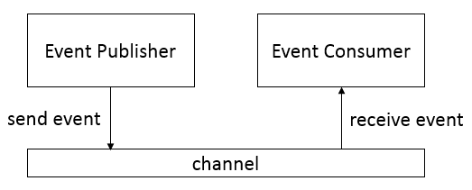

# OSGi Event Admin - Publish &amp; Subscribe

In this blog post I want to write about the publish & subscribe mechanism in OSGi, provided via the OSGi _Event Admin Service_. Of course I will show this in combination with OSGi Declarative Services, because this is the technology I currently like very much, as you probably know from my previous blog posts.

I will start with some basics and then show an example as usual. At last I will give some information about how to use the event mechanism in Eclipse RCP development, especially related to the combination between OSGi services and the GUI.

If you want to read further details on the _Event Admin Service Specification_ have a look at the [OSGi Compendium Specification Chapter 113](https://docs.osgi.org/specification/osgi.cmpn/8.1.0/service.event.html).

Let's start with the basics. The _Event Admin Service_ is based on the [Publish-Subscribe pattern](https://en.wikipedia.org/wiki/Publish%E2%80%93subscribe_pattern). There is an event publisher and an event consumer. Both do not know each other in any way, which provides a high decoupling. Simplified you could say, the event publisher sends an event to a channel, not knowing if anybody will receive that event. On the other side there is an event consumer ready to receive events, not knowing if there is anybody available for sending events. This simplified view is shown in the following picture:

<p align="center">

</p>

Technically both sides are using the _Event Admin Service_ in some way. The event publisher uses it directly to send an event to the channel. The event consumer uses it indirectly by registering an event handler to the EventAdmin to receive events. This can be done programmatically. But with OSGi DS it is very easy to register an event handler by using the whiteboard pattern.

## Event

An `Event` object has a topic and some event properties. It is an immutable object to ensure that every handler gets the same object with the same state.

The topic defines the type of the event and is intended to serve as first-level filter for determining which handlers should receive the event. It is a String arranged in a hierarchical namespace. And the recommendation is to use a convention similar to the Java package name scheme by using reverse domain names (`fully/qualified/package/ClassName/ACTION`). Doing this ensures uniqueness of events. This is of course only a recommendation and you are free to use pseudo class names to make the topic better readable.

Event properties are used to provide additional information about the event. The key is a String and the value can be technically any object. But it is recommended to only use String objects and primitive type wrappers. There are two reasons for this:

1. Other types cannot be passed to handlers that reside external from the Java VM.
2. Other classes might be mutable, which means any handler that receives the event could change values. This break the immutability rule for events.

## Common Bundle

It is some kind of best practice to place common stuff in a common bundle to which the event publisher bundle and the event consumer bundle can have a dependency to. In our case this will only be the definition of the supported topics and property keys in a constants class, to ensure that both implementations share the same definition, without the need to be dependent on each other.

Using PDE Tooling switch to the the _Plug-in Development Perspective_.

- Create a new plug-in project
    - _Main Menu → File → New → Plug-in Project_
    - Set name to _org.fipro.mafia.common_
    - In the _Target Platform_ section select
        - This plug-in is targeted to run with: __*an OSGi framework:*__
        - Select __*standard*__ in the combobox
        - Check __*Generate OSGi metadata automatically*__  
    - Click _Next_
    - Set _Name_ to _Mafia Common_
    - Select _Execution Environment JavaSE-17_
    - Ensure that _Generate an Activator_ and _This plug-in will make contributions to the UI_ are disabled
    - Click _Finish_
    - If you do not see the tabs at the bottom of the recently opened editor with name _org.fipro.mafia.common_, close the editor and open the  _pde.bnd_ file in the project _org.fipro.mafia.common_.
        - Switch to the _pde.bnd_ tab
          - Add the `-runee` instruction to create the requirement on Java 17
            ```
            Bundle-Name: Mafia Common
            Bundle-SymbolicName: org.fipro.mafia.common
            Bundle-Vendor: 
            Bundle-Version: 1.0.0.qualifier
            -runee: JavaSE-17
            ```

_**Note:**_  
With Bndtools create a new _Bnd OSGi Project_ using the _Component Development_ template. For a project layout that uses Bnd and Maven, create a new Maven Module.
I will not repeat this note for every project that will be created in this tutorial.

  - Create a new class `MafiaBossConstants` for the common constants definitions
    - _Main Menu → File → New → Interface_
        - Source Folder: _org.fipro.mafia.common/src_
        - Package: _org.fipro.mafia.common_
        - Name: _MafiaBossConstants_
    - Add the constants definitions

    ``` java
    package org.fipro.mafia.common;

    public final class MafiaBossConstants {

        private MafiaBossConstants() {
            // private default constructor for constants class to avoid someone extends the class
        }

        public static final String TOPIC_BASE = "org/fipro/mafia/Boss/"; 
        public static final String TOPIC_CONVINCE = TOPIC_BASE + "CONVINCE"; 
        public static final String TOPIC_ENCASH = TOPIC_BASE + "ENCASH"; 
        public static final String TOPIC_SOLVE = TOPIC_BASE + "SOLVE"; 
        public static final String TOPIC_ALL = TOPIC_BASE + "*";
        public static final String PROPERTY_KEY_TARGET = "target";
    }
    ```

__*Hint:*__  
You can also copy the above snippet and paste it in Eclipse when having the `src` folder of the project selected in the _Project Explorer_. 
This will automatically create the package and the source file at the correct place. 

- Create the _package-info.java_ file in the `org.fipro.mafia.common` package.
    - _Right click on the package `org.fipro.mafia.common` → New → File_
    - Set _File name_ to _package-info.java_
    - Click _Finish_
    - Copy the following code into the editor and save the file

    ```java
    @org.osgi.annotation.bundle.Export(substitution = org.osgi.annotation.bundle.Export.Substitution.NOIMPORT)
    @org.osgi.annotation.versioning.Version("1.0.0")
    package org.fipro.mafia.common;
    ```

In `MafiaBossConstants` we specify the topic base with a pseudo class _org.fipro.mafia.Boss_, which results in the topic base _org/fipro/mafia/Boss_. 
We specify action topics that start with the topic base and end with the actions CONVINCE, ENCASH and SOLVE. And additionally we specify a topic that starts with the base and ends with the wildcard '\*'.

These constants will be used by the event publisher and the event consumer soon.

## Event Publisher

The _Event Publisher_ uses the _Event Admin Service_ to send events synchronously or asynchronously. Using DS this is pretty easy.

We will create an _Event Publisher_ based on the idea of a mafia boss. 
The boss simply commands a job execution and does not care who is doing it. 
Also it is not of interest if there are many people doing the same job. The job has to be done!

- Create a new plug-in project
    - _Main Menu → File → New → Plug-in Project_
    - Set name to _org.fipro.mafia.boss_
    - In the _Target Platform_ section select
        - This plug-in is targeted to run with: __*an OSGi framework:*__
        - Select __*standard*__ in the combobox
        - Check __*Generate OSGi metadata automatically*__  
    - Click _Next_
    - Set _Name_ to _Mafia Boss_
    - Select _Execution Environment JavaSE-17_
    - Ensure that _Generate an Activator_ and _This plug-in will make contributions to the UI_ are disabled
    - Click _Finish_
    - If you do not see the tabs at the bottom of the recently opened editor with name _org.fipro.mafia.boss_, close the editor and open the  _pde.bnd_ file in the project _org.fipro.mafia.boss_.
        - Switch to the _pde.bnd_ tab
            - Add the `Bundle-ActivationPolicy` to get the bundle automatically started in an Equinox runtime
            - Add the `-runee` instruction to create the requirement on Java 17
            - Add the `-buildpath` instruction to specify the dependency to the Common bundle, the Event Admin Service bundle and the Felix Gogo Runtime bundle
            ```
            Bundle-Name: Mafia Boss
            Bundle-SymbolicName: org.fipro.mafia.boss
            Bundle-Vendor: 
            Bundle-Version: 1.0.0.qualifier
            Bundle-ActivationPolicy: lazy
            -runee: JavaSE-17
            -buildpath: \
                org.osgi.service.event,\
                org.apache.felix.gogo.runtime,\
                org.fipro.mafia.common
            ```

- Create a new package `org.fipro.mafia.boss`
- Create a new class `BossCommand`
  - It should have a reference to the `EventAdmin` which is required for sending events.
  - It creates `Event` objects using a specific topic and a `Map<String, Object>` that contains the additional event properties.
  - It sends an event asynchronously via `EventAdmin#postEvent(Event)`

``` java
package org.fipro.mafia.boss;

import java.util.HashMap;
import java.util.Map;

import org.apache.felix.service.command.Descriptor;
import org.fipro.mafia.common.MafiaBossConstants;
import org.osgi.service.component.annotations.Component;
import org.osgi.service.component.annotations.Reference;
import org.osgi.service.event.Event;
import org.osgi.service.event.EventAdmin;

@Component(
    property = {
        "osgi.command.scope=fipro",
        "osgi.command.function=boss"
    },
    service = BossCommand.class)
public class BossCommand {

    @Reference
    EventAdmin eventAdmin;

    @Descriptor("As a mafia boss you want something to be done")
    public void boss(
        @Descriptor("the command that should be executed. "
            + "possible values are: convince, encash, solve")
        String command,
        @Descriptor("who should be 'convinced', "
            + "'asked for protection money' or 'finally solved'")
        String target) {

        // create the event properties object
        Map<String, Object> properties = new HashMap<>();
        properties.put(MafiaBossConstants.PROPERTY_KEY_TARGET, target);
        Event event = null;
	
        switch (command) {
            case "convince":
                event = new Event(MafiaBossConstants.TOPIC_CONVINCE, properties);
                break;
            case "encash":
                event = new Event(MafiaBossConstants.TOPIC_ENCASH, properties);
                break;
            case "solve":
                event = new Event(MafiaBossConstants.TOPIC_SOLVE, properties);
                break;
            default:
                System.out.println("Such a command is not known!");
        }

        if (event != null) {
            eventAdmin.postEvent(event);
        }
    }
}
```

The `BossCommand` will create an event using the topic that corresponds to the given _command_ parameter. 
The _target_ parameter will be added to a map that is used as event properties. 
This event will then be send to a channel via the `EventAdmin`. 
In the example we use `EventAdmin#postEvent(Event)` which sends the event asynchronously. 
That means, we send the event but do not wait until available handlers have finished the processing. 
If it is required to wait until the processing is done, you need to use `EventAdmin#sendEvent(Event)`, which sends the event synchronously. 
But sending events synchronously is significantly more expensive, as the _Event Admin Service_ implementation needs to ensure that every handler has finished processing before it returns. 
It is therefore recommended to prefer the usage of asynchronous event processing.

_**Note:**_  
The code snippet above uses the annotation `@Descriptor` to specify additional information for the command. This information will be shown when executing **_help boss_** in the OSGi console.
To get it resolved, we added the `org.apache.felix.gogo.runtime` to the `-buildPath` instruction.


## Event Consumer

In our example the boss does not have to tell someone explicitly to do the job. 
He just mentions that the job has to be done. 
Let's assume we have a small organization without hierarchies. 
So we skip the captains etc. and simply implement some soldiers. 
They have specialized, so we have three soldiers, each listening to one special topic.

- Create a new plug-in project
    - _Main Menu → File → New → Plug-in Project_
    - Set name to _org.fipro.mafia.soldier_
    - In the _Target Platform_ section select
        - This plug-in is targeted to run with: __*an OSGi framework:*__
        - Select __*standard*__ in the combobox
        - Check __*Generate OSGi metadata automatically*__  
    - Click _Next_
    - Set _Name_ to _Mafia Soldier_
    - Select _Execution Environment JavaSE-17_
    - Ensure that _Generate an Activator_ and _This plug-in will make contributions to the UI_ are disabled
    - Click _Finish_
    - If you do not see the tabs at the bottom of the recently opened editor with name _org.fipro.mafia.soldier_, close the editor and open the  _pde.bnd_ file in the project _org.fipro.mafia.soldier_.
        - Switch to the _pde.bnd_ tab
            - Add the `Bundle-ActivationPolicy` to get the bundle automatically started in an Equinox runtime
            - Add the `-runee` instruction to create the requirement on Java 17
            - Add the `-buildpath` instruction to specify the dependency to the Common bundle, the Event Admin Service bundle
            ```
            Bundle-Name: Mafia Soldier
            Bundle-SymbolicName: org.fipro.mafia.soldier
            Bundle-Vendor: 
            Bundle-Version: 1.0.0.qualifier
            Bundle-ActivationPolicy: lazy
            -runee: JavaSE-17
            -buildpath: \
                org.osgi.service.event,\
                org.fipro.mafia.common
            ```

- Create a new package `org.fipro.mafia.soldier`
- Create three soldiers `Luigi`, `Mario` and `Giovanni`
  - They need to implement `org.osgi.service.event.EventHandler`
  - They need to register for a topic via service property **_event.topics_**, otherwise the handler will not listen for any event.
  - They output their action and access the event property values via `Event#getProperty(String)`.

``` java
package org.fipro.mafia.soldier;

import org.fipro.mafia.common.MafiaBossConstants;
import org.osgi.service.component.annotations.Component;
import org.osgi.service.event.Event;
import org.osgi.service.event.EventHandler;
import org.osgi.service.event.propertytypes.EventTopics;

@Component
@EventTopics(MafiaBossConstants.TOPIC_CONVINCE)
public class Luigi implements EventHandler {

    @Override
    public void handleEvent(Event event) {
        System.out.println("Luigi: "
            + event.getProperty(MafiaBossConstants.PROPERTY_KEY_TARGET)
            + " was 'convinced' to support our family");
    }
}
```

``` java
package org.fipro.mafia.soldier;

import org.fipro.mafia.common.MafiaBossConstants;
import org.osgi.service.component.annotations.Component;
import org.osgi.service.event.Event;
import org.osgi.service.event.EventHandler;
import org.osgi.service.event.propertytypes.EventTopics;

@Component
@EventTopics(MafiaBossConstants.TOPIC_ENCASH)
public class Mario implements EventHandler {

    @Override 
    public void handleEvent(Event event) {
        System.out.println("Mario: "
            + event.getProperty(MafiaBossConstants.PROPERTY_KEY_TARGET)
            + " payed for protection");
    }
}
``` 

``` java
package org.fipro.mafia.soldier;

import org.fipro.mafia.common.MafiaBossConstants;
import org.osgi.service.component.annotations.Component;
import org.osgi.service.event.Event;
import org.osgi.service.event.EventHandler;
import org.osgi.service.event.propertytypes.EventTopics;

@Component
@EventTopics(MafiaBossConstants.TOPIC_SOLVE)
public class Giovanni implements EventHandler {

    @Override 
    public void handleEvent(Event event) {
        System.out.println("Giovanni: We 'solved' the issue with "
            + event.getProperty(MafiaBossConstants.PROPERTY_KEY_TARGET));
    }
}
```

Technically we have created special `EventHandler` for different topics and registered them via OSGi DS using the whiteboard pattern. 
On the event consumer side we don't need to know the `EventAdmin` itself.

The following service properties are supported by event handlers:

| **Service Registration Property** | **Description** | **Component Property Type** |
| --- | --- | --- |
| _event.topics_ | Specify the topics of interest to an `EventHandler` service. This property is mandatory. | `@EventTopics` |
| _event.filter_ | Specify a filter to further select events of interest to an `EventHandler` service. This property is optional. | `@EventFilter` |
| _event.delivery_ | Specifying the delivery qualities requested by an `EventHandler` service. This property is optional. | `@EventDelivery` |

The property keys and some default keys for event properties are specified in `org.osgi.service.event.EventConstants`. 
To simplify the configuration of the service properties, you can use the related _Component Property Types_.

## Launch the example

Before moving on and explaining further, let's start the example and verify that each command from the boss is only handled by one soldier.

With PDE perform the following steps:

- Select the menu entry _Run -> Run Configurations…_
- In the tree view, right click on the _OSGi Framework_ node and select _New_ from the context menu
- Specify a name, e.g. _OSGi Event Mafia_
- _Deselect All_
- Select the following bundles (note that we are using Eclipse Oxygen, in previous Eclipse versions _org.apache.felix.scr_ and _org.eclipse.osgi.util_ are not required)
    - **Application bundles**
        - _org.fipro.mafia.boss_
        - _org.fipro.mafia.common_
        - _org.fipro.mafia.soldier_
    - **Console bundles**
        - _org.apache.felix.gogo.command_
        - _org.apache.felix.gogo.runtime_
        - _org.apache.felix.gogo.shell_
    - **OSGi framework and DS bundles**
        - _org.eclipse.osgi_
        - _org.apache.felix.scr_
        - _org.osgi.service.component_
        - _org.osgi.util.function_
        - _org.osgi.util.promise_
    - **Equinox Event Admin**
        - _org.eclipse.equinox.event_
        - _org.osgi.service.event_
- Ensure that _Default Auto-Start_ is set to _true_
- Switch to the Arguments tab
    - Remove `-consoleLog -console` from the _Program arguments_
    - Remove `-Dorg.eclipse.swt.graphics.Resource.reportNonDisposed=true` from the _VM arguments_
    - Add `-Dosgi.console=` to the _VM arguments_
- Click _Run_

With Bndtools perform the following steps:

- Open the _launch.bndrun_ file in the _org.fipro.mafia.boss_ project
- On the _Run_ tab add the following bundles to the _Run Requirements_
    - _org.apache.felix.gogo.shell_
    - _org.apache.felix.gogo.command_
    - _org.fipro.mafia.boss_
    - _org.fipro.mafia.soldier_
- Click _Resolve_ to ensure all required bundles are added to the _Run Bundles_ via auto-resolve
- Click _Run OSGi_

Execute the boss command to see the different results. This can look similar to the following:

```
g! boss convince Angelo
Luigi: Angelo was 'convinced' to support our family
g! boss encash Wong
Mario: Wong payed for protection
g! boss solve Tattaglia
Giovanni: We 'solved' the issue with Tattaglia
```

### Handle multiple event topics

It is also possible to register for multiple event topics. Say `Pete` is a tough guy who is good in ENCASH and SOLVE issues. So he registers for those topics.

``` java
package org.fipro.mafia.soldier;

import org.fipro.mafia.common.MafiaBossConstants;
import org.osgi.service.component.annotations.Component;
import org.osgi.service.event.Event;
import org.osgi.service.event.EventHandler;
import org.osgi.service.event.propertytypes.EventTopics;

@Component
@EventTopics({ MafiaBossConstants.TOPIC_CONVINCE, MafiaBossConstants.TOPIC_SOLVE })
public class Pete implements EventHandler {

    @Override public void handleEvent(Event event) {
        System.out.println("Pete: I took care of "
            + event.getProperty(MafiaBossConstants.PROPERTY_KEY_TARGET));
    }
}
```

For this you can use an array as value of the `@EventTopics` annotation:
```java
@EventTopics({ MafiaBossConstants.TOPIC_CONVINCE, MafiaBossConstants.TOPIC_SOLVE })
```

If you configure the service property _**event.topics**_ via the `@Component` annotation type element property, you need to declare it multiple times. 
This way an array of Strings is configured for the service property, so the handler reacts on both topics.
```java
@Component(
    property = {
        EventConstants.EVENT_TOPIC + "=" + MafiaBossConstants.TOPIC_CONVINCE,
        EventConstants.EVENT_TOPIC + "=" + MafiaBossConstants.TOPIC_SOLVE
    }) 
```

If you execute the example now and call _boss convince xxx_ or _boss solve xxx_ you will notice that `Pete` is also responding.

It is also possible to use the asterisk wildcard as last token of a topic. This way the handler will receive all events for topics that start with the left side of the wildcard.

Let's say we have a very motivated young guy called `Ray` who wants to prove himself to the boss. So he takes every command from the boss. For this we set the service property `event.topics=org/fipro/mafia/Boss/*`

``` java
package org.fipro.mafia.soldier;

import org.fipro.mafia.common.MafiaBossConstants;
import org.osgi.service.component.annotations.Component;
import org.osgi.service.event.Event;
import org.osgi.service.event.EventHandler;
import org.osgi.service.event.propertytypes.EventTopics;

@Component
@EventTopics(MafiaBossConstants.TOPIC_ALL)
public class Ray implements EventHandler {

    @Override 
    public void handleEvent(Event event) { 
        String topic = event.getTopic();
        Object target = event.getProperty(MafiaBossConstants.PROPERTY_KEY_TARGET);

        switch (topic) { 
            case MafiaBossConstants.TOPIC_CONVINCE:
                System.out.println("Ray: I helped in punching the shit out of" + target); 
                break; 
            case MafiaBossConstants.TOPIC_ENCASH:
                System.out.println("Ray: I helped getting the money from " + target); 
                break; 
            case MafiaBossConstants.TOPIC_SOLVE:
                System.out.println("Ray: I helped killing " + target); 
                break; 
            default:
                System.out.println("Ray: I helped with whatever was requested!"); 
        } 
    }
}
```

Executing the example again will show that `Ray` is responding on every boss command.

### Event Filter

It is also possible to filter events based on event properties by setting the service property _**event.filter**_. The value needs to be an LDAP filter. For example, although `Ray` is a motivated and loyal soldier, he refuses to handle events that target his friend _Sonny_. To specify the service property in a more convenient way, you can use the `@EventFilter` component property type.

The following snippet shows how to specify a filter that excludes event processing if the target is _Sonny_.

``` java
package org.fipro.mafia.soldier;

import org.fipro.mafia.common.MafiaBossConstants;
import org.osgi.service.component.annotations.Component;
import org.osgi.service.event.Event;
import org.osgi.service.event.EventHandler;
import org.osgi.service.event.propertytypes.EventFilter;
import org.osgi.service.event.propertytypes.EventTopics;

@Component
@EventTopics(MafiaBossConstants.TOPIC_ALL)
@EventFilter("(!(target=Sonny))")
public class Ray implements EventHandler {
```

Execute the example and call two commands:

- _boss solve Angelo_
- _boss solve Sonny_

You will notice that `Ray` will respond on the first call, but he will not show up on the second call.

_**Note:**_  
The filter expression can only be applied on **event properties**. It is not possible to use that filter on **service properties**.

### Event Delivery

At last it is possible to configure in which order the event handler wants the events to be delivered. This can either be ordered in the same way they are posted, or unordered. The service property **_event.delivery_** can be used to change the default behavior, which is to receive the events from a single thread in the same order as they were posted.

If an event handler does not need to receive events in the order as they were posted, you need to specify the service property `event.delivery=async.unordered`.
To specify the service property in a more convenient way, you can use the `@EventFilter` component property type.

``` java
package org.fipro.mafia.soldier;

import org.fipro.mafia.common.MafiaBossConstants;
import org.osgi.service.component.annotations.Component;
import org.osgi.service.event.Event;
import org.osgi.service.event.EventConstants;
import org.osgi.service.event.EventHandler;
import org.osgi.service.event.propertytypes.EventDelivery;
import org.osgi.service.event.propertytypes.EventFilter;
import org.osgi.service.event.propertytypes.EventTopics;

@Component
@EventTopics(MafiaBossConstants.TOPIC_ALL)
@EventFilter("(!(target=Sonny))")
@EventDelivery(EventConstants.DELIVERY_ASYNC_UNORDERED)
public class Ray implements EventHandler {
```

The value for ordered delivery is `async.ordered` which is the default. The values are also defined in the `EventConstants`.

## Capabilities

By using the event mechanism the code is highly decoupled. In general this is a good thing, but it also makes it hard to identify issues. One common issue in Eclipse RCP for example is to forget to automatically start the bundle _org.eclipse.equinox.event_. Things will simply not work in such a case, without any errors or warnings shown on startup.

The reason for this is that the related interfaces like `EventAdmin` and `EventHandler` are located in the bundle _org.osgi.service.event_. The bundle wiring therefore shows that everything is ok on startup, because all interfaces and classes are available. But we require a bundle that contains an implementation of `EventAdmin`. If you remember my [Getting Started Tutorial](getting-started-with-osgi-declarative-services.md), such a requirement can be specified by using capabilities.

There are two capabilities to consider:
- `osgi.service` capability used by the bundle that uses the `EventAdmin`  
```
Require-Capability: osgi.service;
  filter:="(objectClass=org.osgi.service.event.EventAdmin)";
  effective:=active
```  
Luckily with the _Automatic Manifest Generation_ project layout, this entry is generated for us automatically.
- `osgi.implementation` capability inspected by the resolver for the runtime  
```
Require-Capability: osgi.implementation;
       filter:="(&(osgi.implementation=osgi.event)
                 (version>=1.4.0)(!(version>=2.0.0)))"
```  
This capability requirement can be added via the `@RequireEventAdmin` annotation.
If you use one of the Event Admin Component Property Type annotations, it is not necessary to explicitly add the `@RequireEventAdmin`.
It is used by those annotations already and therefore added transitively.

## Handling events in Eclipse RCP UI

When looking at the architecture of an Eclipse RCP application, you will notice that the UI layer is not created via OSGi DS (actually that is not a surprise!). 
And we can not simply say that our view parts are created via DS, because the lifecycle of a part is controlled by other mechanics. 
But as an Eclipse RCP application is typcially an application based on OSGi, all the OSGi mechanisms can be used. 
Of course not that convenient as with using OSGi DS directly.

The direction from the UI layer to the OSGi service layer is pretty easy. 
You simply need to retrieve the service you want to use. 
With Eclipse 4 you simply get the desired service injected using `@Inject` in combination with `@Service` since Eclipse Oxygen (see [OSGi Declarative Services news in Eclipse Oxygen](https://vogella.com/blog/osgi-declarative-services-news-in-eclipse-oxygen/)). 
With Eclipse 3.x you needed to retrieve the service programmatically via the `BundleContext`.

The other way to communicate from a service to the UI layer is something different. There are two ways to consider from my point of view:

- make use of the [Observer pattern](https://en.wikipedia.org/wiki/Observer_pattern)
- make use of the [Publish & Subscribe pattern](https://en.wikipedia.org/wiki/Publish%E2%80%93subscribe_pattern)

This blog post is about the event mechanism in OSGi, so I don't want to go in detail with the observer pattern approach. 
It simply means that you extend the service interface to accept listeners to perform callbacks. 
Which in return means you need to retrieve the service in the view part for example, and register a callback function from there.

With the _Publish & Subscribe_ pattern we register an `EventHandler` that reacts on events. 
It is a similar approach to the Observer pattern, with some slight differences. 
But this is not a design pattern blog post, we are talking about the event mechanism. 
And we already registered an `EventHandler` using OSGi DS. 
The difference to the scenario using DS is that we need to register the `EventHandler` programmatically. 
For OSGi experts that used the event mechanism before DS came up, this is nothing new. For all others that learn about it, it could be interesting.

The following snippet shows how to retrieve a `BundleContext` instance and register a service programmatically. 
In earlier days this was done in an `Activator`, as there you have access to the `BundleContext`. 
Nowadays it is recommended to use the `FrameworkUtil` class to retrieve the `BundleContext` when needed, and to avoid `Activator`s to reduce startup time.

``` java
private ServiceRegistration<?> eventHandler;

...

// retrieve the bundle of the calling class 
Bundle bundle = FrameworkUtil.getBundle(getClass()); 
BundleContext bc = (bundle != null) ? bundle.getBundleContext() : null;
if (bc != null) { 
    // create the service properties instance 
    Dictionary<String, Object> properties = new Hashtable<>(); 
    properties.put(EventConstants.EVENT_TOPIC, MafiaBossConstants.TOPIC_ALL);

    // register the EventHandler service 
    eventHandler = bc.registerService(EventHandler.class.getName(), new EventHandler() {

        @Override
        public void handleEvent(Event event) {
            // ensure to update the UI in the UI thread 
            Display.getDefault().asyncExec(() -> handlerLabel.setText(
                "Received boss command " + event.getTopic()
                + " for target " + event.getProperty(MafiaBossConstants.PROPERTY_KEY_TARGET))); 
        } 
    }, properties); 
}
```

This code can be technically added anywhere in the UI code, e.g. in a view, an editor or a handler. 
But of course you should be aware that the event handler also should be unregistered once the connected UI class is destroyed. 
For example, you implement a view part that registers a listener similar to the above to update the UI everytime an event is received. 
That means the handler has a reference to a UI element that should be updated. 
If the part is destroyed, also the UI element is destroyed. 
If you don't unregister the `EventHandler` when the part is destroyed, it will still be alive and react on events and probably cause exceptions without proper disposal checks. 
It is also a cause for memory leaks, as the `EventHandler` references a UI element instance that is already disposed but can not be cleaned up by the GC as it is still referenced.

_**Note:**_  
The event handling is executed in its own event thread. 
Updates to the UI can only be performed in the _main_ or _UI thread_, otherwise you will get a `SWTException` for _Invalid thread access_. 
Therefore it is necessary to ensure that UI updates performed in an event handler are executed in the UI thread. 
For further information have a look at [Eclipse Jobs and Background Processing](http://www.vogella.com/tutorials/EclipseJobs/article.html). 
For the UI synchronization you should also consider using asynchronous execution via `Display#asyncExec()` or `UISynchronize#asyncExec()`. 
Using synchronous execution via `syncExec()` will block the event handler thread until the UI update is done.

If you stored the `ServiceRegistration` object returned by `BundleContext#registerService()` as shown in the example above, the following snippet can be used to unregister the handler if the part is destroyed:

``` java
if (eventHandler != null) {
    eventHandler.unregister();
}
``` 

In Eclipse 3.x this needs to be done in the overriden `dispose()` method. 
In Eclipse 4 it can be done in the method annotated with `@PreDestroy`.

_**Note:**_  
Ensure that the bundle that contains the code is in ACTIVE state so there is a `BundleContext`. This can be achieved by setting `Bundle-ActivationPolicy: lazy` in the _MANIFEST.MF_.

## Handling events in Eclipse RCP UI with Eclipse 4

In Eclipse 4 the event handling mechanism is provided to the RCP development via the `EventBroker`. 
The `EventBroker` is a service that uses the `EventAdmin` and additionally provides injection support. 
To learn more about the `EventBroker` and the event mechanism provided by Eclipse 4 you should read the related tutorials, like

- [Eclipse 4 event system](http://www.vogella.com/tutorials/Eclipse4EventSystem/article.html)
- [Eclipse RCP Cookbook – The Food Combining Recipe (OSGi Declarative Services and Events)](https://github.com/fipro78/e4-cookbook-basic-recipe/blob/master/tutorials/Eclipse_RCP_Cookbook_Services_Events.md)

We are focusing on the event consumer here. 
Additionally to registering the `EventHandler` programmatically, it is possible in Eclipse 4 to specify a method for method injection that is called on event handling by additionally providing support for injection.

Such an event handler method looks similar to the following snippet:

``` java
@Inject
@Optional 
void handleConvinceEvent(@UIEventTopic(MafiaBossConstants.TOPIC_CONVINCE) String target) { 
    e4HandlerLabel.setText("Received boss CONVINCE command for " + target); 
}
```

By using `@UIEventTopic` you ensure that the code is executed in the UI thread. 
If you don't care about the UI thread, you can use `@EventTopic` instead. 
The handler that is registered in the back will also be automatically unregistered if the containing instance is destroyed.

While the method gets directly invoked as event handler, the injection does not work without modifications on the event producer side. 
For this the data that should be used for injection needs to be added to the event properties for the key _**org.eclipse.e4.data**_. 
This key is specified as a constant in `IEventBroker`. 
But using the constant would also introduce a dependency to _org.eclipse.e4.core.services_, which is not always intended for event producer bundles. 
Therefore modifying the generation of the event properties map in `BossCommand` will make the E4 event handling injection work:

``` java
// create the event properties object 
Map<String, Object> properties = new HashMap<>(); 
properties.put(MafiaBossConstants.PROPERTY_KEY_TARGET, target); 
properties.put("org.eclipse.e4.data", target); 
```

The sources for this tutorial are hosted on GitHub in the already existing projects:

- [OSGi DS Getting Started (PDE)](https://github.com/fipro78/osgi-ds-getting-started-pde)  
  This repository contains the sources in PDE project layout.
- [OSGi DS Getting Started (Bndtools)](https://github.com/fipro78/osgi-ds-getting-started-bndtools)  
  This repository contains the sources in Bndtools project layout using a Bndtools workspace.
- [OSGi DS Gettings Started (Bnd with Maven)](https://github.com/fipro78/osgi-ds-getting-started-bnd-maven)  
  This repository contains the sources in a Maven project layout that uses the bnd Maven plugins.

The PDE version also includes a sample project _org.fipro.mafia.ui_ which is a very simple RCP application that shows the usage of the event handler in a view part.
